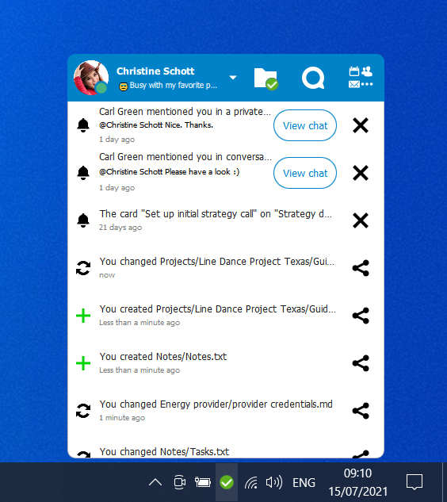

<!--
  - SPDX-FileCopyrightText: 2017 Nextcloud GmbH and Nextcloud contributors
  - SPDX-FileCopyrightText: 2011 Nextcloud GmbH and Nextcloud contributors
  - SPDX-License-Identifier: GPL-2.0-or-later
-->
# Nextcloud Desktop Client

[](https://api.reuse.software/info/github.com/nextcloud/desktop)

The Nextcloud Desktop Client is a tool to synchronize files from Nextcloud Server with your computer.

<p align="center">
    
</p>

## Releases 🚀
For the latest stable recommended version, please refer to the [download page https://nextcloud.com/install/#install-clients](https://nextcloud.com/install/#install-clients)

## Contributing to the desktop client 🫴
:v: Please read the [Code of Conduct](https://nextcloud.com/community/code-of-conduct/). This document offers some guidance to ensure Nextcloud participants can cooperate effectively in a positive and inspiring atmosphere and to explain how together we can strengthen and support each other.

## Join the team 👪
There are many ways to contribute, of which development is only one! Find out [how to get involved](https://nextcloud.com/contribute/), including as a translator, designer, tester, helping others, and much more! 😍

## Help testing 🔬
Download and install the client:<br>
[🔽 All releases](https://github.com/nextcloud-releases/desktop/releases)<br>
[🔽 Daily master builds](https://download.nextcloud.com/desktop/daily)

## Reporting issues 🐛
If you find any bugs or have any suggestion for improvement, please
[open an issue in this repository](https://github.com/nextcloud/desktop/issues).

## Bug fixing and development 🛠️

> [!TIP]
> For contributors on macOS, there is an [Xcode workspace](./Nextcloud%20Desktop%20Client.xcworkspace/) prepared for development.
> See [the dedicated documentation](./doc/xcode-workspace.md) for further information.

> [!TIP]
> For building the client on macOS we have a tool called `mac-crafter`.
> You will find more information about it in [its dedicated README](admin/osx/mac-crafter/README.md).
> Also, please note the [README in the NextcloudIntegration project](shell_integration/MacOSX/NextcloudIntegration/README.md) which provides an even more convenient way to work on and build the desktop client on macOS by using Xcode.

> [!NOTE]  
> Find the system requirements and instructions on [how to work on Windows with KDE Craft](https://github.com/nextcloud/desktop-client-blueprints/) on our [desktop client blueprints repository](https://github.com/nextcloud/desktop-client-blueprints/).

### System requirements
- [Windows 10, Windows 11](https://github.com/nextcloud/desktop-client-blueprints/), macOS 10.14 Mojave (or newer) or Linux
- [🔽 Inkscape (to generate icons)](https://inkscape.org/release/)
- Developer tools: cmake, clang/gcc/g++:
- Qt6 since 3.14, Qt5 for earlier versions
- OpenSSL
- [🔽 QtKeychain](https://github.com/frankosterfeld/qtkeychain)
- SQLite
- [Xcode](https://developer.apple.com/xcode/) (only on macOS)

Optional recommendations:

- [Qt Creator IDE](https://www.qt.io/product/development-tools)
- [delta: A viewer for git and diff output](https://github.com/dandavison/delta)

### Build

Step by step instructions on how to build the client to contribute.

1. Clone the Github repository: `git clone https://github.com/nextcloud/desktop.git`
2. Create build directory: `mkdir <build directory>`
3. Navigate into build directory: `cd <build directory>`
4. Compile: `cmake -S <cloned desktop repo> -B build -DCMAKE_PREFIX_PATH=<dependencies> -DCMAKE_BUILD_TYPE=Debug -DCMAKE_INSTALL_PREFIX=. -DNEXTCLOUD_DEV=ON`

> [!TIP]
> The cmake variable NEXTCLOUD_DEV allows you to run your own build of the client while developing in parallel with an installed version of the client.

Then you might continue with these steps:
	
1. 🐛 [Pick a good first issue](https://github.com/nextcloud/desktop/labels/good%20first%20issue)
2. 👩‍🔧 Create a branch and make your changes. Remember to sign off your commits using `git commit -sm "Your commit message"`
3. ⬆ Create a [pull request](https://opensource.guide/how-to-contribute/#opening-a-pull-request) and `@mention` the people from the issue to eview
4. 👍 Fix things that come up during a review
5. 🎉 Wait for it to get merged!

### Test servers

The easiest way to have a local Nextcloud server to develop, debug and test the client against is [the Nextcloud Docker image](https://github.com/nextcloud/docker).
The following example shows how to deploy a Nextcloud Docker container on the local host which will be removed again as soon as the command is interrupted.
Note that this requires Docker to be installed in your developer environment.

```bash
docker run \
    --rm \
    --publish 8080:80 \
    --env SQLITE_DATABASE=nextcloud.sqlite \
    --env NEXTCLOUD_ADMIN_USER=admin \
    --env NEXTCLOUD_ADMIN_PASSWORD=admin \
    nextcloud
```

This simple test server already suffices in the most cases. For more advanced server test deployments we also recommend [Nextcloud development environment on Docker Compose](https://juliusknorr.github.io/nextcloud-docker-dev/).

## Get in touch 💬
* [📋 Forum](https://help.nextcloud.com)
* [👥 Facebook](https://www.facebook.com/nextclouders)
* [🐣 Twitter](https://twitter.com/Nextclouders)
* [🐘 Mastodon](https://mastodon.xyz/@nextcloud)

You can also [get support for Nextcloud](https://nextcloud.com/support)!

## License 📜

    This program is free software; you can redistribute it and/or modify
    it under the terms of the GNU General Public License as published by
    the Free Software Foundation; either version 2 of the License, or
    (at your option) any later version.

    This program is distributed in the hope that it will be useful, but
    WITHOUT ANY WARRANTY; without even the implied warranty of MERCHANTABILITY
    or FITNESS FOR A PARTICULAR PURPOSE. See the GNU General Public License
    for more details.
