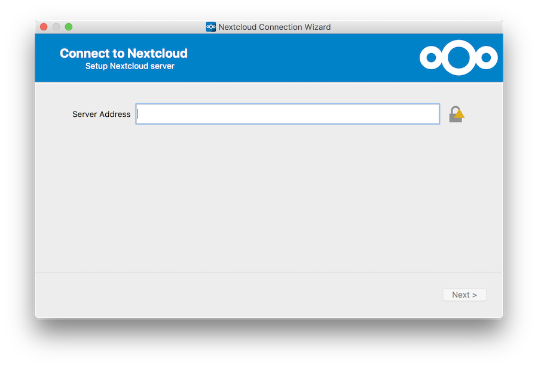
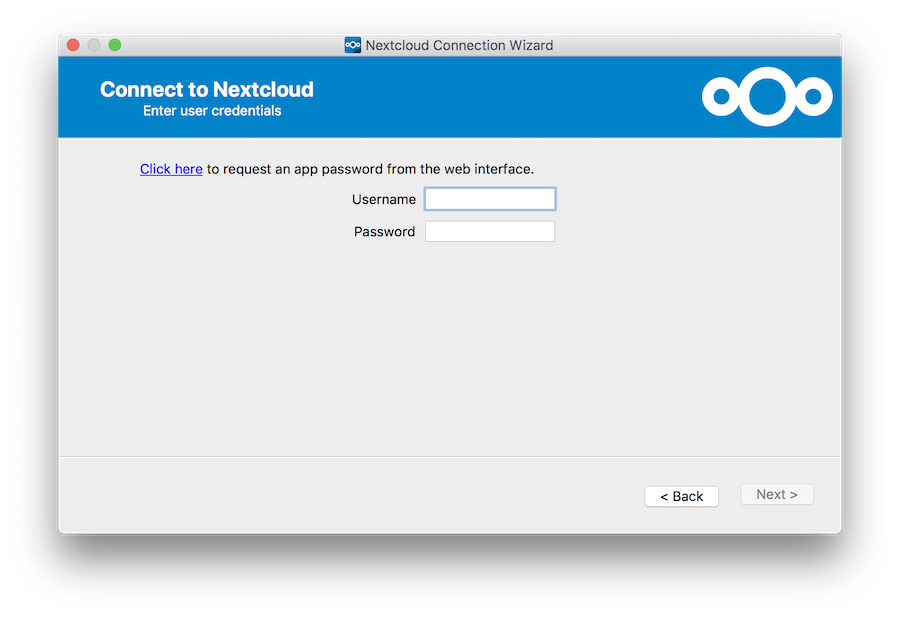
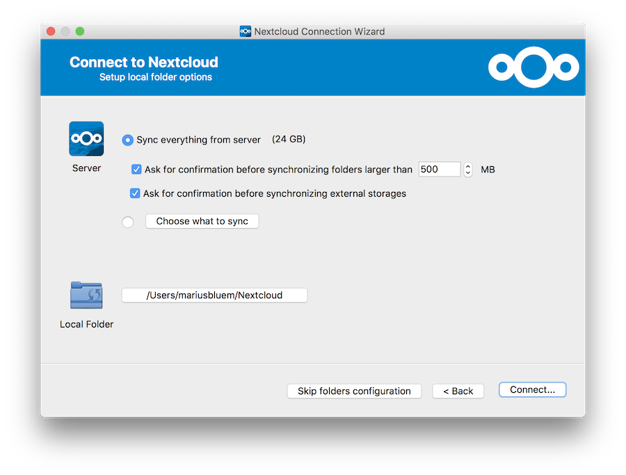
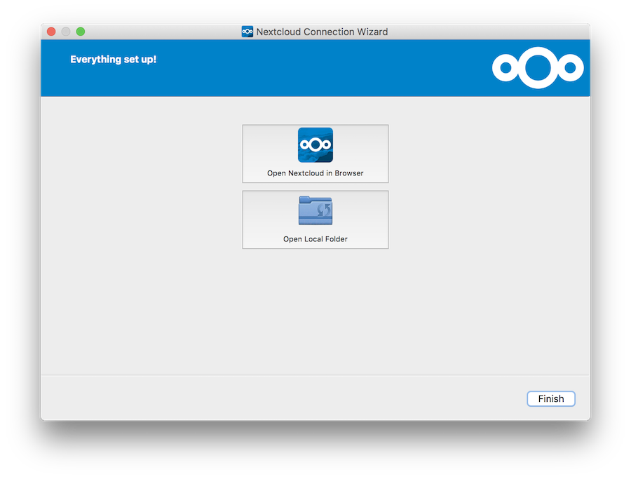

Setting up an Account
=====================

If no account has been configured, ownCloud Client will automatically assist
you in connecting to your ownCloud Server after the application has been
started.

As a first step, specify the URL to your Server, just
like you would when you open your ownCloud instance inside a browser.

.. note:: Make sure to use ``https://`` if the server supports it. Otherwise,
   your password and all data will be transferred to the server unencrypted.
   This makes it easy for third parties to intercept your communication, and
   getting hold of your password!

Next, you are prompted for your username and password. Again, use the same
credentials that you would use to log on via the web interface.

Finally, choose the folder that ownCloud Client is supposed to sync the
contents of your ownCloud account with. By default, this is a folder
called `ownCloud`, which will reside in your home directory.

After pressing `Connect`, ownCloud Client will commence with the syncing
process. The next screen will give you the opportunity to review your
settings:

