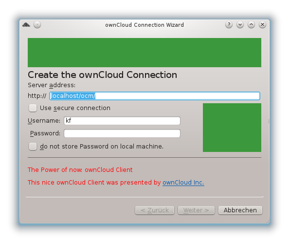

Branding the ownCloud Client
============================

The ownCloud Client supports theming in the setup assistant dialog in both the
account setting and the result window. These customizations do not require a
recompile of the client.

The dialogs have places where custom content can be inserted. Please take a look
on the screenshot below. For example the connection wizard has the two green
rectangles as well as the area at the bottom with the black line and the red
text.

The content places can be altered by a file called ``custom.ini`` which contains
content for the specific places in the dialogs.

On windows, the custom.ini has to be stored at

+-----------------+------------------------------------------------------------+
| OS              | Path                                                       |
+=================+============================================================+
| Windows (64 bit)| ``%ProgramFiles(x86)%\ownCloud\custom.ini``                |
+-----------------+------------------------------------------------------------+
| Windows (32 bit)| ``%ProgramFiles%\ownCloud\custom.ini``                     |
+-----------------+------------------------------------------------------------+
| Mac OS          | ``owncloud.app/Contents/Resources/custom.ini``             |
+-----------------+------------------------------------------------------------+
| Linux           | ``/etc/ownCloud/custom.ini``                               |
+-----------------+------------------------------------------------------------+

The config file needs to be in a usual `Windows INI file format`_.

Under the group definition [GUICustomize] the following keys can be set:

* ``oCSetupTop``: The top area of the connect wizard, account page.
* ``oCSetupSide``: The side area of the connect wizard, account page.
* ``ocSetupBottom``: The bottom area of the connect wizard, account page
* ``oCSetupResultTop``: The top area of the connect wizard result page.
* ``oCSetupFixUrl``: An fixed url to the ownCloud instance. If this is set, the
   user can not access the url entry field and it is hidden.

The keys can be set to either an image file or a `rich text`_ snippet, which
must be enclosed with  double quotes. Image files must be addressed by the
complete file name. On windows, the pathes should be noted with slashes
instead of backslashes. Instead of absolute file pathes, you can use
the ``%RESOURCES`` placeholder (note the single ``%``!).

Example::

  ``%RESOURCES/custom/myimage_top.png

.. note:: ``%RESOURCES`` is currently undefined on Linux, it points to the
          directory location of ``custom.ini`` on all other platforms.

Example
~~~~~~~

A config file ``custom.ini`` like this::

  [GUICustomize]
  oCSetupTop=/home/kf/owncloud.com/topimg.png
  oCSetupSide=/home/kf/owncloud.com/sideimg.png
  oCSetupBottom="
  

  The Power of now: ownCloud Client

  This nice ownCloud Client was presented by <a
  href="http://owncloud.com">ownCloud Inc.</a>
  "
  oCSetupResultTop=/home/kf/owncloud.com/topimg.png

will produce this setup dialog:

  Setup Dialog Customization

Packaging remarks
~~~~~~~~~~~~~~~~~

While you do not need to rebuild the client, you will need to repackage
the client on your own. This also means you will have to resign those
packages with your own signing key.

.. _`Windows INI file format`: http://en.wikipedia.org/wiki/INI_file
.. _`rich text`: http://qt-project.org/doc/qt-5.0/richtext-html-subset.html 

