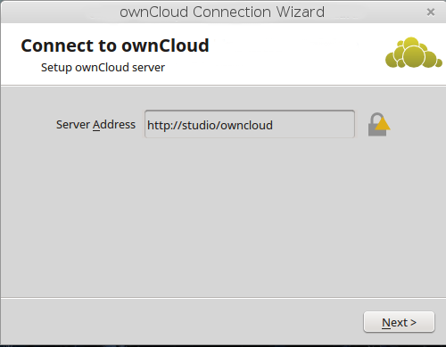
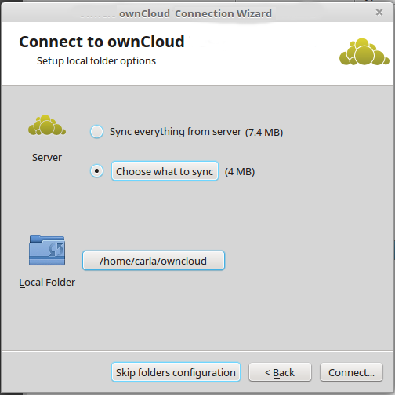
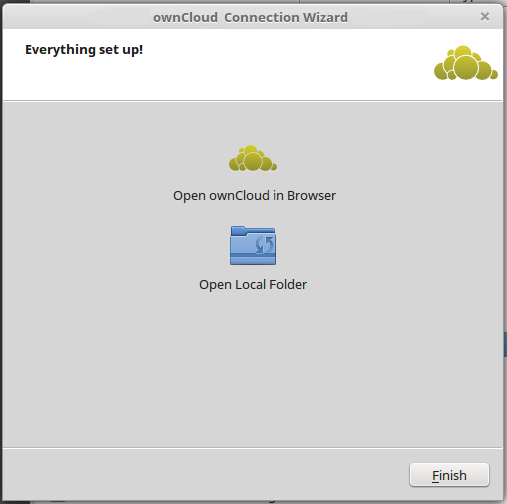

=============================================
Installing the Desktop Synchronization Client
=============================================

You can download the  latest version of the Nextcloud Desktop Synchronization
Client from the `Nextcloud download page`_.
There are clients for Linux, macOS, and Microsoft Windows.

Installation on macOS and Windows is the same as for any software
application: download the program and then double-click it to launch the
installation, and then follow the installation wizard. After it is installed and
configured the sync client will automatically keep itself updated; see
:doc:`autoupdate` for more information.

Linux users must follow the instructions on the download page to add the
appropriate repository for their Linux distribution, install the signing key,
and then use their package managers to install the desktop sync client. Linux
users will also update their sync clients via package manager, and the client
will display a notification when an update is available.

Linux users must also have a password manager enabled, such as GNOME Keyring or
KWallet, so that the sync client can login automatically.

You will also find links to source code archives and older versions on the
download page.

System Requirements
----------------------------------

- Windows 7+
- macOS 10.7+ (**64-bit only**)

Installation Wizard
-------------------

The installation wizard takes you step-by-step through configuration options and
account setup. First you need to enter the URL of your Nextcloud server.

Enter your Nextcloud login on the next screen.

On the Local Folder Option screen you may sync
all of your files on the Nextcloud server, or select individual folders. The
default local sync folder is ``Nextcloud``, in your home directory. You may
change this as well.

    them in.

When you have completed selecting your sync folders, click the Connect button
at the bottom right. The client will attempt to connect to your Nextcloud
server, and when it is successful you'll see two buttons: one to connect to
your Nextcloud Web GUI, and one to open your local folder. It will also start
synchronizing your files.

    Web GUI, and one to open your local Nextcloud folder

Click the Finish button, and you're all done.

.. Links

.. _Nextcloud download page: https://nextcloud.com/download/#install-clients
