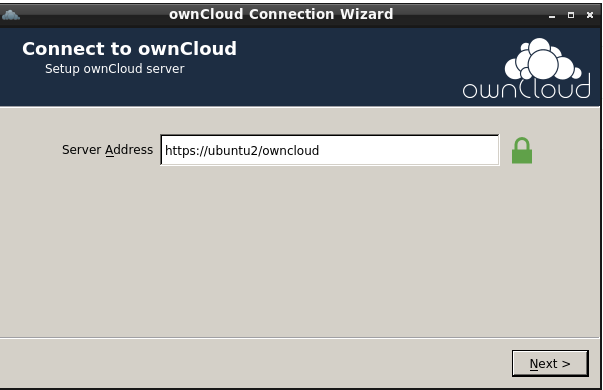
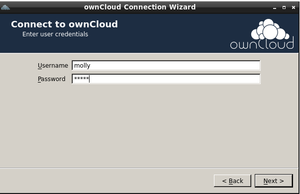
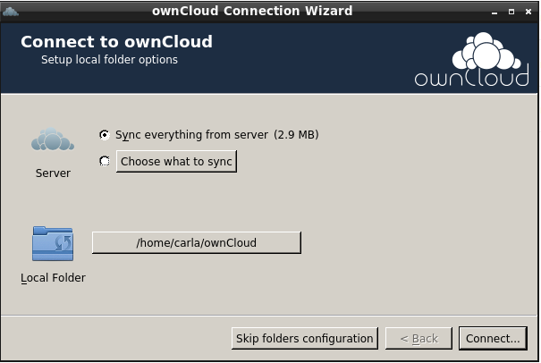
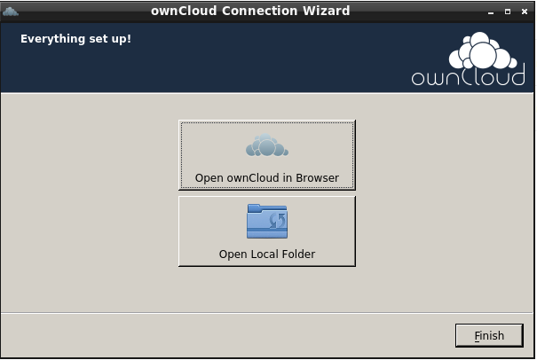
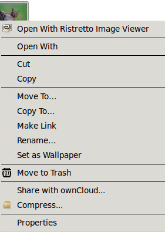
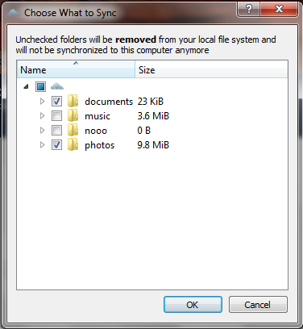
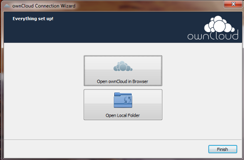
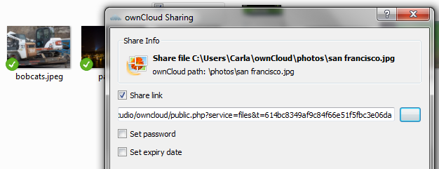
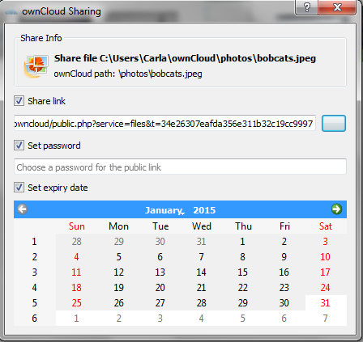

=============================================
Installing the Desktop Synchronization Client
=============================================

You can download the  latest version of the ownCloud Desktop Synchronization 
Client from the `ownCloud Website <https://owncloud.org/install/#desktop>`_. 
There are clients for Linux, Mac OS X, and Microsoft Windows.

Installation on Mac OS X and Windows is the same as for any software 
application: download the program and then double-click it to launch the 
installation, and then follow the installation wizard. After it is installed and 
configured the sync client will automatically keep itself updated; see 
:doc:`autoupdate` for more information.

Linux users must follow the instructions on the download page to add the 
appropriate repository for their Linux distribution, install the signing key, 
and then use their package managers to install the desktop sync client. Linux 
users will also update their sync clients via package manager, and the client 
will display a notification when an update is available.

Linux users must also have a password manager enabled, such as GNOME Keyring or
KWallet, so that the sync client can login automatically.

Improvements and New Features
-----------------------------

The 1.8 client has a number of enhancements and performance improvements, 
including:

* Graphical selective sync file and folder selector. Select which files and 
  folders to sync with just a few clicks.
* Selective sync on account setup. Set up which files and folders you want to 
  sync when you create a new ownCloud account.
* File manager integration: share files from Windows Explorer, Mac OS X Finder, 
  and Nautilus on Linux.
* Faster uploads and downloads.

.. note:: When you upgrade from 1.7, restart Windows to ensure that all new 
   features are visible.

Installation
------------

The installation wizard takes you step-by-step through configuration options and 
account setup. These examples are on Windows 7; note the new "Integration for 
Windows Explorer Option". This allows Windows users to share files directly 
from their local ownCloud folder in Windows Explorer, rather than having to 
open a Web browser and share from the ownCloud Web interface. Mac users get the 
same option for Finder, and Linux users for Nautilus. 

The next screen selects the installation folder for the client. The default is 
fine; don't change this without a good reason.

In the next screen, enter your ownCloud server URL.

If your ownCloud server has a self-signed SSL certificate, you will see a scary 
warning. Check "Trust this certificate" and keep going.

On the next screen enter your ownCloud login and password.

Now you can select while folders and files to sync, and the location of your 
local ownCloud folder.

.. image:: images/client6.png

When you check "Choose what to sync" it opens a file picker. Note the warning 
at the top that unchecked folders will be removed from your local filesystem. 
On a new installation, when you have not yet synced with your ownCloud server, 
no files will be deleted.

In the next screen you may click to open ownCloud in a Web browser, or open 
your local ownCloud folder. Open your local ownCloud folder so you can see how 
file manager integration works.

When you are in your local ownCloud folder you can right-click any file or 
folder, and then left-click "Share with ownCloud" to create a share link. Note that Windows
may also have a Share With option. This is not the ownCloud Share option. The 
ownCloud share dialog looks like the following example:

You have the same options for creating a link share as you do when you're 
logged into the ownCloud Web GUI: you may optionally set a password and 
expiration date.

You may change your sync options at any time by opening your ownCloud client 
and clicking the "Choose what to sync" button. This opens the same file picker 
you saw in the installation wizard. If you un-check any folders or files that 
you have already synchronized they will be deleted.

.. image:: images/client11.png
