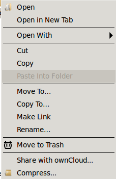

=============================================
Installing the Desktop Synchronization Client
=============================================

You can download the  latest version of the ownCloud Desktop Synchronization 
Client from the `ownCloud Website <https://owncloud.org/install/#desktop>`_. 
There are clients for Linux, Mac OS X, and Microsoft Windows.

Installation on Mac OS X and Windows is the same as for any software 
application: download the program and then double-click it to launch the 
installation, and then follow the installation wizard. After it is installed and 
configured the sync client will automatically keep itself updated; see 
:doc:`autoupdate` for more information.

Linux users must follow the instructions on the download page to add the 
appropriate repository for their Linux distribution, install the signing key, 
and then use their package managers to install the desktop sync client. Linux 
users will also update their sync clients via package manager, and the client 
will display a notification when an update is available. 

Linux users must also have a password manager enabled, such as GNOME Keyring or
KWallet, so that the sync client can login automatically.

Installation Wizard
-------------------

The installation wizard takes you step-by-step through configuration options and 
account setup. First you need to enter the URL of your ownCloud server.

.. image:: images/client-1.png
   :alt: form for entering ownCloud server URL
   
Enter your ownCloud login on the next screen.

.. image:: images/client-2.png
   :alt: form for entering your ownCloud login

On the Local Folder Option screen you may sync 
all of your files on the ownCloud server, or select individual folders. The 
default local sync folder is ``ownCloud``, in your home directory. You may 
change this as well.

.. image:: images/client-3.png
   :alt: Select which remote folders to sync, and which local folder to store 
    them in.
   
When you have completed selecting your sync folders, click the Connect button 
at the bottom right. The client will attempt to connect to your ownCloud 
server, and when it is successful you'll see two buttons: one to connect to 
your ownCloud Web GUI, and one to open your local folder. It will also start 
synchronizing your files.

.. image:: images/client-4.png
   :alt: A successful server connection, showing a button to connect to your 
    Web GUI, and one to open your local ownCloud folder

Click the Finish button, and you're all done.   

When you are in your local ownCloud folder, you can right-click any file or 
folder, and then left-click "Share with ownCloud" to create a share link. Note 
that Windows may also have a Share With option. This is not the ownCloud Share 
option. Linux users must install the ``owncloud-client-nautilus`` package to 
enable file sharing from the Nautilus file manager. The ownCloud share dialog 
looks like the following example on Ubuntu Linux:

    right-click file menu in your file manager

You may change your sync options at any time by opening your ownCloud client 
and selecting which folders to sync, or to remove from synchronization.
you saw in the installation wizard. **If you un-check any folders that 
you have already synchronized, they will be deleted from your local system.**

.. image:: images/client-6.png
   :alt: Client dialogue to select different files to sync, or to remove from 
    syncing
