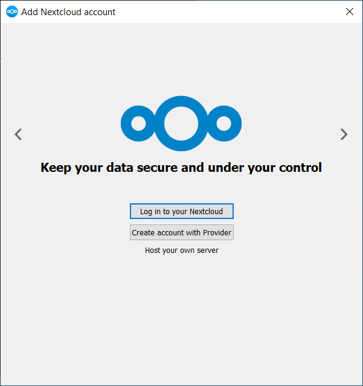
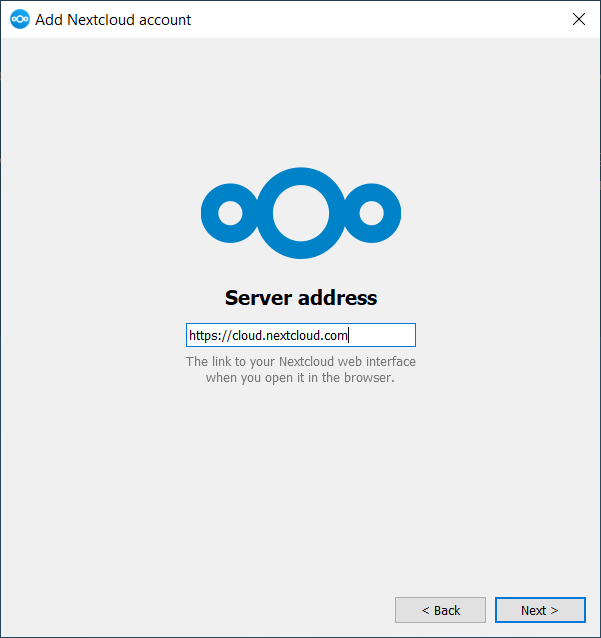
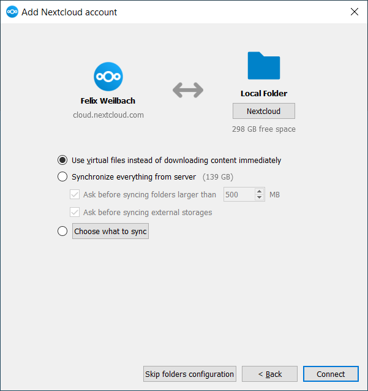

=============================================
Installing the Desktop Synchronization Client
=============================================

You can download the latest version of the Nextcloud Desktop Synchronization
Client from the `Nextcloud download page`_.
There are clients for Linux, macOs, and Microsoft Windows.

The currently supported server releases are the latest three stable versions
at time of publication. It means that the |version| release series is supporting
stable server major versions.
See https://github.com/nextcloud/server/wiki/Maintenance-and-Release-Schedule for
supported major versions.

Installation on Mac OS X and Windows is the same as for any software
application: download the program and then double-click it to launch the
installation, and then follow the installation wizard. After it is installed and
configured the sync client will automatically keep itself updated; see
:doc:`autoupdate` for more information.

Linux users must follow the instructions on the download page to add the
appropriate repository for their Linux distribution, install the signing key,
and then use their package managers to install the desktop sync client. Linux
users will also update their sync clients via package manager, and the client
will display a notification when an update is available.

Linux users must also have a password manager enabled, such as GNOME Keyring or
KWallet, so that the sync client can login automatically.

You will also find links to source code archives and older versions on the
download page.

System Requirements
----------------------------------

- Windows 10+ (64-bits only)
- macOS 11.4+ (64-bits only)
- Linux (ubuntu 22.04 or openSUSE 15.5 or ...) (64-bits only)

.. note::
   For Linux distributions, we support, if technically feasible, the current LTS releases.
   For BSD, we support them if technically feasible but we do not test

Customizing the Windows Installation
------------------------------------

If you just want to install Nextcloud Desktop Synchronization Client on your local
system, you can simply launch the `.msi` file and configure it in the wizard
that pops up.

Features
^^^^^^^^

The MSI installer provides several features that can be installed or removed
individually, which you can also control via command-line, if you are automating
the installation, then run the following command::

   msiexec /passive /i Nextcloud-x.y.z-x64.msi

The command will install the Nextcloud Desktop Synchronization Client into the default location
with the default features enabled.
If you want to disable, e.g., desktop shortcut icons you can simply change the above command to the following::

   msiexec /passive /i Nextcloud-x.y.z-x64.msi REMOVE=DesktopShortcut

See the following table for a list of available features:

+--------------------+--------------------+-----------------------------------+---------------------------+
| Feature            | Enabled by default | Description                       |Property to disable        |
+====================+====================+===================================+===========================+
| Client             | Yes, required      | The actual client                 |                           |
+--------------------+--------------------+-----------------------------------+---------------------------+
| DesktopShortcut    | Yes                | Adds a shortcut to the desktop    |``NO_DESKTOP_SHORTCUT``    |
+--------------------+--------------------+-----------------------------------+---------------------------+
| StartMenuShortcuts | Yes                | Adds a shortcut to the start menu |``NO_START_MENU_SHORTCUTS``|
+--------------------+--------------------+-----------------------------------+---------------------------+
| ShellExtensions    | Yes                | Adds Explorer integration         |``NO_SHELL_EXTENSIONS``    |
+--------------------+--------------------+-----------------------------------+---------------------------+

Installation
~~~~~~~~~~~~

You can also choose to only install the client itself by using the following command::

  msiexec /passive /i Nextcloud-x.y.z-x64.msi ADDDEFAULT=Client

If you for instance want to install everything but the ``DesktopShortcut`` and the ``ShellExtensions`` feature, you have two possibilities:

1. You explicitly name all the features you actually want to install (whitelist) where `Client` is always installed anyway::

    msiexec /passive /i Nextcloud-x.y.z-x64.msi ADDDEFAULT=StartMenuShortcuts

2. You pass the `NO_DESKTOP_SHORTCUT` and `NO_SHELL_EXTENSIONS` properties::

    msiexec /passive /i Nextcloud-x.y.z-x64.msi NO_DESKTOP_SHORTCUT="1" NO_SHELL_EXTENSIONS="1"

.. NOTE::
    The Nextcloud `.msi` remembers these properties, so you don't need to specify them on upgrades.

.. NOTE::
    You cannot use these to change the installed features, if you want to do that, see the next section.

Changing Installed Features
~~~~~~~~~~~~~~~~~~~~~~~~~~~

You can change the installed features later by using `REMOVE` and `ADDDEFAULT` properties.

1. If you want to add the the desktop shortcut later, run the following command::

    msiexec /passive /i Nextcloud-x.y.z-x64.msi ADDDEFAULT="DesktopShortcut"

2. If you want to remove it, simply run the following command::

    msiexec /passive /i Nextcloud-x.y.z-x64.msi REMOVE="DesktopShortcut"

Windows keeps track of the installed features and using `REMOVE` or `ADDDEFAULT` will only affect the mentioned features.

Compare `REMOVE <https://msdn.microsoft.com/en-us/library/windows/desktop/aa371194(v=vs.85).aspx>`_
and `ADDDEFAULT <https://msdn.microsoft.com/en-us/library/windows/desktop/aa367518(v=vs.85).aspx>`_
on the Windows Installer Guide.

.. NOTE::
    You cannot specify `REMOVE` on initial installation as it will disable all features.

Installation Folder
^^^^^^^^^^^^^^^^^^^

You can adjust the installation folder by specifying the `INSTALLDIR`
property like this::

  msiexec /passive /i Nextcloud-x.y.z-x64.msi INSTALLDIR="C:\Program Files\Non Standard Nextcloud Client Folder"

Be careful when using PowerShell instead of `cmd.exe`, it can be tricky to get
the whitespace escaping right there.
Specifying the `INSTALLDIR` like this only works on first installation, you cannot simply re-invoke the `.msi` with a different path. If you still need to change it, uninstall it first and reinstall it with the new path.

Disabling Automatic Updates
^^^^^^^^^^^^^^^^^^^^^^^^^^^

To disable automatic updates, you can pass the `SKIPAUTOUPDATE` property.::

    msiexec /passive /i Nextcloud-x.y.z-x64.msi SKIPAUTOUPDATE="1"

Launch After Installation
^^^^^^^^^^^^^^^^^^^^^^^^^

To launch the client automatically after installation, you can pass the `LAUNCH` property.::

    msiexec /i Nextcloud-x.y.z-x64.msi LAUNCH="1"

This option also removes the checkbox to let users decide if they want to launch the client
for non passive/quiet mode.

.. NOTE::
    This option does not have any effect without GUI.

No Reboot After Installation
^^^^^^^^^^^^^^^^^^^^^^^^^^^^

The Nextcloud Client schedules a reboot after installation to make sure the Explorer extension is correctly (un)loaded.
If you're taking care of the reboot yourself, you can set the `REBOOT` property::

    msiexec /i Nextcloud-x.y.z-x64.msi REBOOT=ReallySuppress

This will make `msiexec` exit with error `ERROR_SUCCESS_REBOOT_REQUIRED` (3010).
If your deployment tooling interprets this as an actual error and you want to avoid that, you may want to set the `DO_NOT_SCHEDULE_REBOOT` instead::

    msiexec /i Nextcloud-x.y.z-x64.msi DO_NOT_SCHEDULE_REBOOT="1"

Installation Wizard
-------------------

The installation wizard takes you step-by-step through configuration options and
account setup. First, you need to enter the URL of your Nextcloud server.

If you already have an account on a Nextcloud instance, you want to
press the button ``Login to your Nextcloud``. If you don't have a
Nextcloud instance and an account there, you might want to register an
account with a provider. Press ``Create account with Provider`` in
that case. Please keep in mind that the desktop client might have
built without provider support. In that case, you won't see this
page. Instead, you will be prompted with the next page.

Enter the URL for your Nextcloud instance. The URL is the same URL that
you type into your browser when you try to access your Nextcloud
instance.

.. image:: images/wizard_flow2.png
   :alt: form waiting for authorization

Now your web browser should open and prompt you to login into your
Nextcloud instance. Enter your username and password in your web
browser and grant access. After you did that, go back to the
wizard. Please keep in mind that you might not need to enter your
username and password if you are already logged in to your browser.

    them in.

On the local folder options screen, you may sync all of your files on
the Nextcloud server, or select individual folders. The default local
sync folder is ``Nextcloud``, in your home directory. You may change
this as well.

When you have completed selecting your sync folders, click the Connect
button at the bottom right. The client will attempt to connect to your
Nextcloud server, and when it is successful, the wizard closes
itself. You can now observe the sync activity if you open the main
dialogue by clicking on the tray icon.

.. Links

.. _Nextcloud download page: https://nextcloud.com/download/#install-clients
