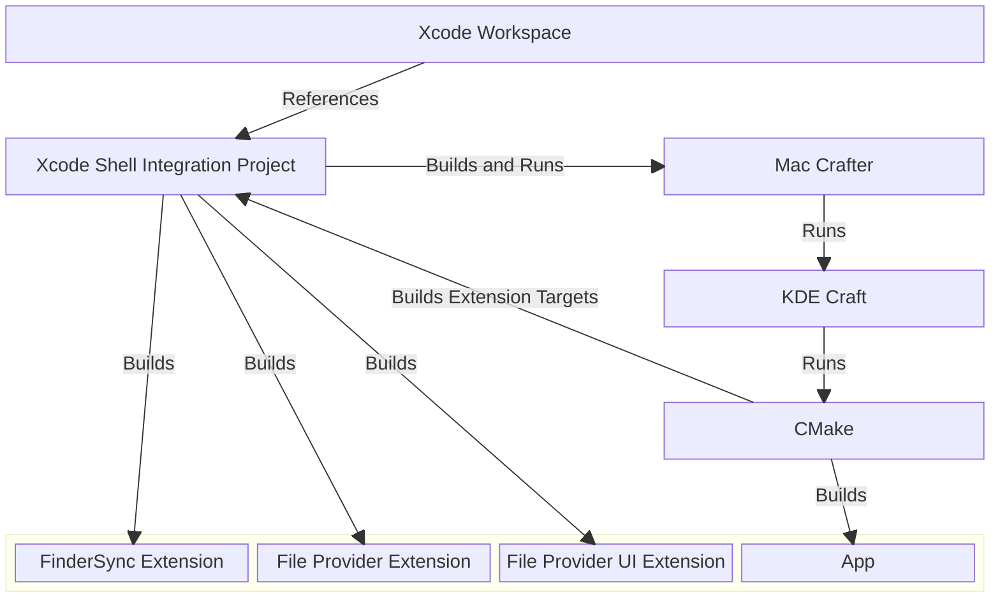

<!--
  - SPDX-FileCopyrightText: 2026 Nextcloud GmbH and Nextcloud contributors
  - SPDX-License-Identifier: GPL-2.0-or-later
-->

# macOS Development

This is the entry point for contributors who want to work on the Nextcloud desktop client on macOS and submit bug fixes or feature implementations through pull requests.

**tl;dr:** Open "[Nextcloud Desktop Client.xcworkspace](../Nextcloud%20Desktop%20Client.xcworkspace/)", select the "NextcloudDev" scheme and hit `⌘ + R`.

## Quick Start

1. Clone the repository.
2. Replace the Apple Development Team identifier with your own — see [Set Your Apple Development Team](#set-your-apple-development-team).
3. Open `Nextcloud Desktop Client.xcworkspace`, select the "NextcloudDev" scheme and run.

## System Requirements

- macOS 13 Ventura or newer
- [Xcode](https://developer.apple.com/xcode/)
- An Apple Development certificate for signing in your keychain (any Apple Developer account is sufficient — see below)
- Python 3
- [Homebrew](https://brew.sh) (for installing additional tools like `inkscape`, `pyenv`, and `create-dmg`)
- [🔽 Inkscape (to generate icons)](https://inkscape.org/release/)

The Xcode workspace orchestrates the rest of the toolchain (KDE Craft, CMake, Qt, OpenSSL, QtKeychain, SQLite) through `mac-crafter`. You do not need to install these dependencies separately for a contributor build.

## Initial Setup

### Clone the Repository

```sh
git clone https://github.com/nextcloud/desktop.git
cd desktop
```

### Set Your Apple Development Team

Two files default the Apple Development Team to Nextcloud GmbH's identifier `NKUJUXUJ3B`. Unless you are part of that team, replace both occurrences with your own 10-character Apple Developer Team ID so Xcode can sign builds with your personal development certificate:

- [`NEXTCLOUD.cmake`](../NEXTCLOUD.cmake) — the `DEVELOPMENT_TEAM` cache variable
- [`shell_integration/MacOSX/NextcloudIntegration/NextcloudDev/Build.xcconfig`](../shell_integration/MacOSX/NextcloudIntegration/NextcloudDev/Build.xcconfig) — the `DEVELOPMENT_TEAM` default

You can find your team ID on the [Apple Developer Account page](https://developer.apple.com/account) under "Membership details". After substitution, `grep -rn 'NKUJUXUJ3B' .` from the repo root should return no results.

Being signed in to Xcode with any Apple developer account is sufficient to generate a personal development signing certificate. The team identifier you substitute above must match the team that issued that certificate.

### Open the Xcode Workspace

Open [`Nextcloud Desktop Client.xcworkspace`](../Nextcloud%20Desktop%20Client.xcworkspace/) in Xcode. Select the "NextcloudDev" scheme and run (`⌘ + R`).

## Project Structure

Xcode is the default integrated developer environment on macOS, and our multi-platform [Qt](https://www.qt.io) app includes native macOS app extensions written in Swift and Objective-C which are most convenient to debug there. The workspace ties together the Qt-driven CMake build and the native extension build.

### How the Pieces Fit



- The **workspace** is an umbrella for several Swift packages and an Xcode project containing the native macOS app extensions. The packages and the Xcode project are meant to remain functionally independent from the workspace and have their own dedicated documentation.
- The **Xcode shell integration project** contains an optional convenience target ("NextcloudDev") for developers which runs `mac-crafter` through a shell script with default arguments.
- **`mac-crafter`** is a command-line tool that reduces the macOS build to a single invocation. It drives KDE Craft and CMake.
- **CMake** uses the Xcode project to build the native app extension targets.
- CMake then combines the Qt main app build with the native macOS app extensions into a macOS app bundle.
- The lower block in the diagram represents the final Nextcloud desktop client app bundle produced by this pipeline.
- Further project-specific dependencies like NextcloudFileProviderKit, NextcloudCapabilitiesKit or TransifexStringCatalogSanitizer are left out of the diagram for simplicity.

### Build Artifact Locations

To isolate working environments and simplify cache busting, build artifacts and derived data are stored in unconventional locations. This also helps to resolve KDE Craft build errors caused by overly long file paths.

- **`mac-crafter`:** the tool is invoked with the `build` directory at the repository clone root as its build data location. See [`Craft.sh`](../shell_integration/MacOSX/NextcloudIntegration/NextcloudDev/Craft.sh). A top-level location reduces path-length issues that have surfaced in KDE Craft dependencies in the past. You might still encounter that problem, if your repository clone has a too long path prefix.
- **Built app bundle:** the NextcloudDev build deliberately places the built app at `/Applications` rather than in Xcode's derived data. Derived-data paths would otherwise be absolute and contain the current user name, making the scheme non-portable.

When no build is running, it is safe to remove the `build` directory in the project root. This is sometimes necessary to resolve build errors caused by outdated intermediate artifacts.

## Day-to-Day Workflow

### Build & Run

The "NextcloudDev" scheme integrates `mac-crafter` as an external build system. Selecting it and running (`⌘ + R`) builds, runs, and attaches the debugger.

Internally, the scheme runs [`Craft.sh`](../shell_integration/MacOSX/NextcloudIntegration/NextcloudDev/Craft.sh), which invokes `mac-crafter` with the arguments required to produce a debug-friendly bundle. One of the key factors is the `Debug` build type, which flips switches in the CMake build scripts (for example app hardening and the `get-task-allow` entitlement, see [PR #8474](https://github.com/nextcloud/desktop/pull/8474/files)).

### Debugging

A few helpful LLDB snippets for inspecting Qt state on breakpoints in Xcode:

#### Print a `QString`

```lldb
call someString.toStdString()
```

#### Print a `QStringList`

```lldb
call someStrings.join("\n").toStdString()
```

### Attaching to File Provider Extensions

You can debug the file provider extension processes in Xcode by attaching to them by binary name:

1. _Debug_ → _Attach to Process by PID or Name…_
2. Enter `FileProviderExt`. To also debug the file provider UI extension, attach to `FileProviderUIExt` as well.
3. Confirm. If no process is currently running, Xcode will wait for one to be launched and attach automatically — which usually happens when you launch the main app or set up a new account with the file provider enabled.

## Translations

Transifex is used for localization. Currently, [the file provider UI extension](https://app.transifex.com/nextcloud/nextcloud/client-fileproviderui/) has a localizable resource maintained through Xcode string catalogs. These localizations are excluded from the usual automated translation flow due to how Transifex synchronizes Xcode string catalogs and the resulting risk of data loss. The dedicated [`shell_integration/MacOSX/NextcloudIntegration/.tx/config`](../shell_integration/MacOSX/NextcloudIntegration/.tx/config) file drives the manual workflow described below.

### Pulling Translations

Run this in the `shell_integration/MacOSX/NextcloudIntegration` directory of your repository clone:

```sh
tx pull --force --all --mode=translator
```

The `translator` mode is important here and for later, so unreviewed strings are included and not accidentally deleted. See [the official Transifex documentation on Xcode string catalogs and download modes](https://help.transifex.com/en/articles/9459174-xcode-strings-catalogs-xcstrings#h_786f60d73b). Do not commit the changed string catalogs yet — they need to be processed first.

#### Sanitize Translations

Transifex returns empty strings for keys with untranslated localizations. Remove them with the Swift command-line utility [TransifexStringCatalogSanitizer](../shell_integration/MacOSX/TransifexStringCatalogSanitizer/) — see its dedicated README for usage. Apply it to every updated Xcode string catalog.

#### Summary

```sh
tx pull --force --all --mode=translator
swift run --package-path=../TransifexStringCatalogSanitizer TransifexStringCatalogSanitizer ./FileProviderUIExt/Localizable.xcstrings
```

### Pushing Translations

**Follow this section carefully end to end before performing any of the steps.**
The way Transifex handles Xcode string catalogs creates a high risk of accidentally deleting already-finished translations on Transifex: pushing a string catalog overwrites the online state with the local catalog as-is. Changes on Transifex must be integrated locally first to avoid data loss, before the updated local string catalog can be pushed.

1. Perform the pulling steps above.
2. Build the extensions in Xcode. This causes the compiler to update the string catalogs from the current source code by recognizing localizable texts automatically. As of writing, the "desktopclient" scheme is a good choice because it builds both file provider extensions as dependencies.
3. Run `TransifexStringCatalogSanitizer` over both string catalogs as in the previous section.
4. Inspect the changes to the string catalogs in a Git diff or your preferred diff tool. Verify the plausibility of each change.
5. Run `tx push` in the `shell_integration/MacOSX/NextcloudIntegration` directory.
6. Check Transifex to confirm new keys arrived and obsolete ones were deleted.

## Where to Look Next

- **Direct `mac-crafter` CLI usage / branding builds** → [`admin/osx/mac-crafter/README.md`](../admin/osx/mac-crafter/README.md)
- **Qt + macOS App Sandbox internals** → [`doc/macOS-Sandbox-Qt.md`](./macOS-Sandbox-Qt.md)
- **NextcloudFileProviderKit Swift package** → [`shell_integration/MacOSX/NextcloudFileProviderKit/README.md`](../shell_integration/MacOSX/NextcloudFileProviderKit/README.md)
