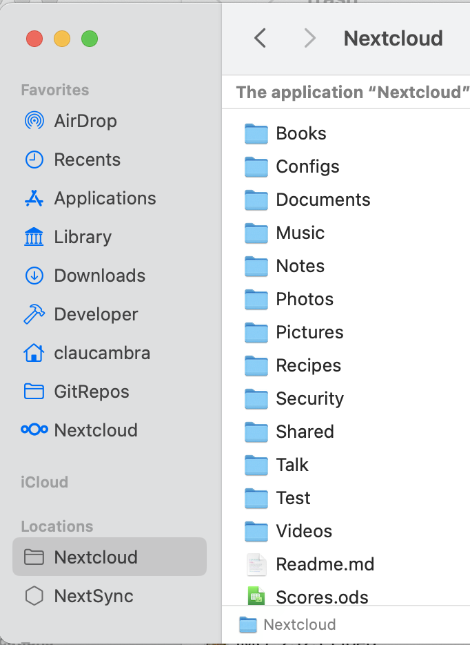
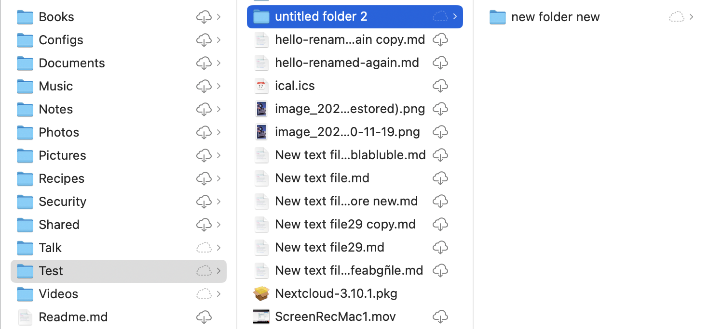
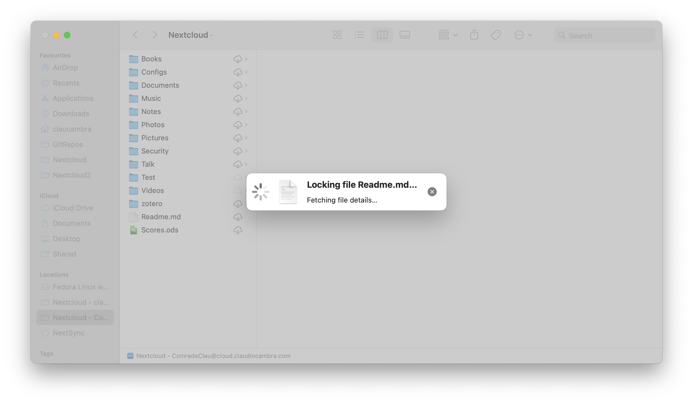
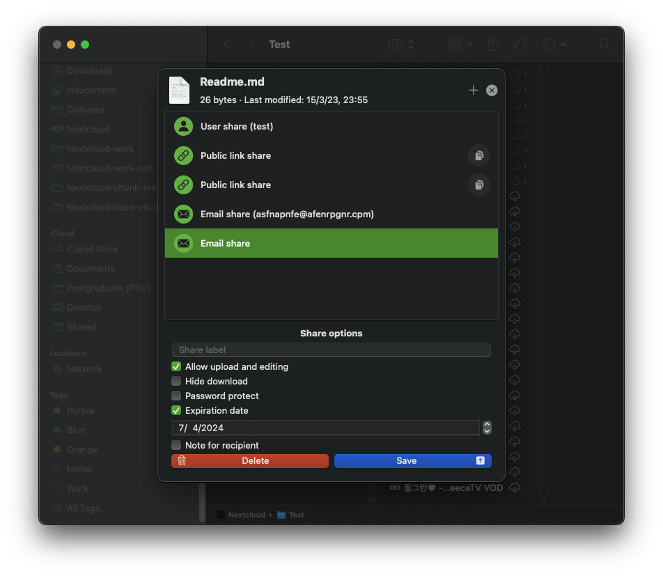

====

macOS Virtual Files

====

.. index:: macosvfs

macOS Virtual Files client
============

Virtual file-based synchronisation for Nextcloud desktop users is now
available on macOS.

Unlike on Windows, virtual files support on macOS is provided by a
separate client version. This allows us to maintain the best possible
experience for classically-synced files, including sync status
integration and context menu actions, for users who want to keep using
this sync method. Just like our classic sync client, the macOS virtual
files client is released alongside the desktop client for Windows and
Linux, and will benefit from regular bug-fix and feature updates that
improve the user experience.

Supported features
------------------

- Per-file local retention and eviction
- Intelligent local copy eviction
- Integration with Spotlight
- File previews within Finder for virtual files
- Support for Apple-specific formats such as app bundles and iWork
  (Pages, Numbers, Keynote) bundles
- Remote file locking compatibility
- “Edit locally” support
- File sharing with other users
- Automatic synchronisation of remote changes
- More!

.. note::
   To improve remote change detection, we recommend enabling the
   ``notify_push`` app on your Nextcloud server. This app will notify
   the desktop client of changes on the server as soon as they happen,
   reducing the time it takes for the client to detect changes. This
   will also eliminate the need for the desktop client to continuously
   poll the server for changes.

Installation and initial setup
==============================

The virtual files client is distributed as an installer package that
resembles the macOS classic sync client. The desktop client can be
installed by following the steps presented by the installer.

The virtual files desktop client is interchangeable with the classic
sync desktop client. This means your existing accounts and settings will
carry over to this client and vice-versa, should you ever decide to go
back to the classic sync client. This includes any pre-existing standard
sync folders, as the virtual files client also supports classic sync.

.. note::
    Due to technical limitations in macOS we are unable to provide
    integration in Finder for both classic sync folders and virtual file
    sync folders. Classic sync folders in the virtual files client will
    therefore not have Finder integrations such as sync state icons or
    context menu actions.

Any existing or newly-configured accounts will have virtual files
automatically enabled. On macOS, each account’s virtual files live under
their own domain, separate from any pre-existing classic sync folders.
These domains can be found listed under the “Locations” group in the
Finder sidebar.

Upon first accessing one of these domains, the desktop client will being
to request information on remote files from the server. This first
synchronisation may take some time depending on the quantity of files
hosted on the server.

Finder integration
==================

The virtual files client has distinct Finder integrations that allow it
to more deeply and more natively integrate with the macOS file browser
than the classic sync client.

Sync status indicators
----------------------

Similarly to classic sync client, the virtual files client displays
icons next to virtual files that indicate what their status is.

- *Cloud with arrow*: item or its children is virtual and is available
  for local keeping
- *Cloud outline*: item is partially available locally
- *No icon*: item is available offline

Context menu actions
--------------------

Control-clicking, two-finger clicking, or right-clicking on a Finder
item will provide the context menu, in which you may find several
entries provided by the virtual files client that allow you to use some
of the features supported by Nextcloud. These include:

- File locking (if supported by server)

- File sharing (if supported by server)

Configuration
=============

Virtual files-related settings can be adjusted on a per-account basis
via the Nextcloud desktop client’s settings window.

.. image:: images/macosvfs-settings.png
   :alt: macOS virtual files settings

The virtual files section offers a number of options relevant to
virtual files interaction:

- Enable/disable virtual files for the target account
- Enable/disable fast sync
- Manage local storage usage and evict local copies
- Force the virtual files domain to check for updates
