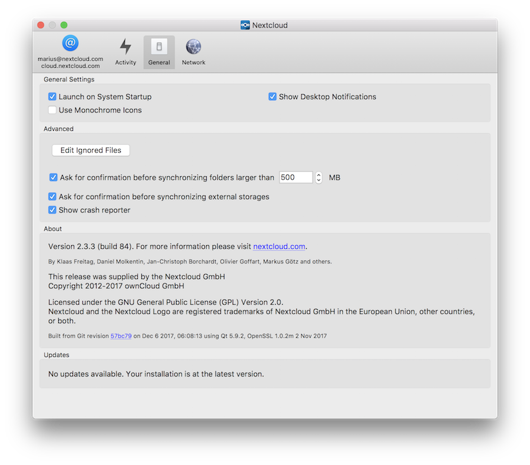
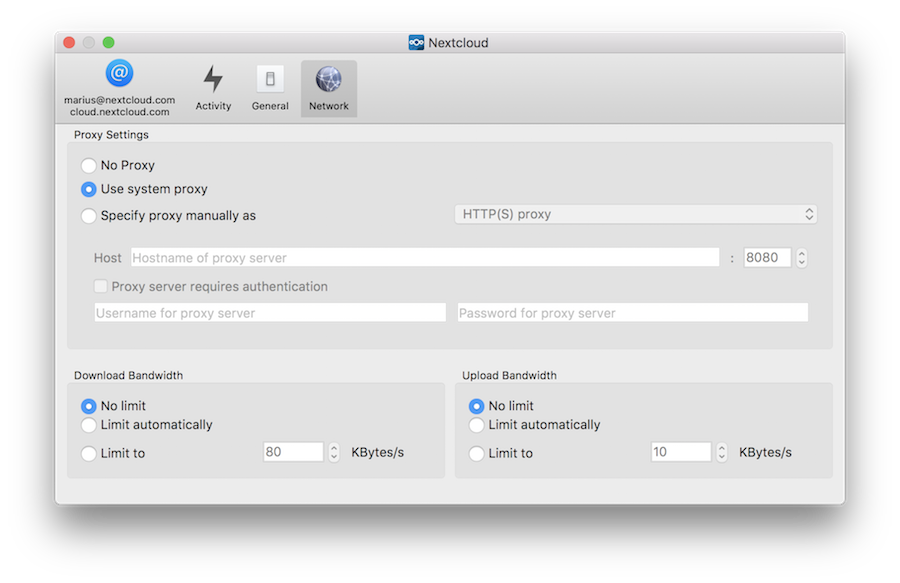

================================
Using the Synchronization Client
================================

.. index:: navigating, usage

The Nextcloud Desktop Client remains in the background and is visible as an icon 
in the system tray (Windows, KDE), status bar (Mac OS X), or notification area 
(Linux).

.. figure:: images/icon.png
   :alt: Status icon, green circle and white checkmark 

The status indicator uses icons to indicate the current status of your 
synchronization. The green circle with the white checkmark tells you that your 
synchronization is current and you are connected to your Nextcloud server.

.. figure:: images/icon-syncing.png
   :alt: Status icon, blue circle and white semi-circles

The blue icon with the white semi-circles means synchronization is in progress.

.. figure:: images/icon-paused.png
   :alt: Status icon, yellow circle and vertical parallel 
    lines

The yellow icon with the parallel lines tells you your synchronization 
has been paused. (Most likely by you.)

.. figure:: images/icon-offline.png
   :alt: Status icon, gray circle and three horizontal 
    white dots

The gray icon with three white dots means your sync client has lost its 
connection with your Nextcloud server.

.. figure:: images/icon-information.png
   :alt: Status icon, sign "!" in yellow circle

When you see a yellow circle with the sign "!" that is the informational icon, 
so you should click it to see what it has to tell you.

.. figure:: images/icon-error.png
   :alt: Status icon, red circle and white x

The red circle with the white "x" indicates a configuration error, such as an 
incorrect login or server URL.

Systray Icon
------------

A right-click on the systray icon opens a menu for quick access to multiple 
operations.

.. figure:: images/menu.png
   :alt: the right-click sync client menu

This menu provides the following options:

* Quick access to your accounts
* Sync status
* Recent Changes, showing latest activities
* Settings
* Help menu
* Pause synchronizations
* An option to log in or log out of all of your accounts at once
* Quit Nextcloud, logging out and closing the client

A left-click on your systray icon opens the desktop client to the account 
settings window.

Configuring Nextcloud Account Settings
^^^^^^^^^^^^^^^^^^^^^^^^^^^^^^^^^^^^^^

.. index:: account settings, user, password, Server URL

At the top of the window are tabs for each configured sync account, and three 
others for Activity, General and Network settings. On your account tabs you 
have the following features:

* Connection status, showing which Nextcloud server you are connected to, and 
  your Nextcloud username.
* An **Account** button, which contains a dropdown menu with **Add New**, 
  **Log Out**, and **Remove**.
* Used and available space on the server.
* Current synchronization status.
* **Add Folder Sync Connection** button.

The little button with three dots (the overflow menu) that sits to the right of 
the sync status bar offers four additional options:

* Open Folder
* Choose What to Sync (This appears only when your file tree is collapsed, and 
  expands the file tree)
* Pause Sync / Resume Sync
* Remove folder sync connection

**Open Folder** opens your local Nextcloud sync folder.

**Pause Sync** pauses sync operations without making any changes to your 
account. It will continue to update file and folder lists, without 
downloading or updating files. To stop all sync activity use **Remove 
Folder Sync Connection**.

   
.. note:: Nextcloud does not preserve the mtime (modification time) of 
   directories, though it does update the mtimes on files. See  
   `Wrong folder date when syncing 
   <https://github.com/owncloud/core/issues/7009>`_ for discussion of this.  
   
Adding New Accounts
^^^^^^^^^^^^^^^^^^^

You may configure multiple Nextcloud accounts in your desktop sync client. Simply 
click the **Account** > **Add New** button on any account tab to add a new 
account, and then follow the account creation wizard. The new account will 
appear as a new tab in the settings dialog, where you can adjust its settings at 
any time. Use **Account** > **Remove** to delete accounts. 

File Manager Overlay Icons
--------------------------

The Nextcloud sync client provides overlay icons, in addition to the normal file 
type icons, for your system file manager (Explorer on Windows, Finder on Mac and 
Nautilus on Linux) to indicate the sync status of your Nextcloud files.

The overlay icons are similar to the systray icons introduced above. They 
behave differently on files and directories according to sync status 
and errors. 

The overlay icon of an individual file indicates its current sync state. If the
file is in sync with the server version, it displays a green checkmark.

If the file is ignored from syncing, for example because it is on your 
exclude list, or because it is a symbolic link, it displays a warning icon.

If there is a sync error, or the file is blacklisted, it displays an 
eye-catching red X.

If the file is waiting to be synced, or is currently syncing, the overlay 
icon displays a blue cycling icon.

When the client is offline, no icons are shown to reflect that the 
folder is currently out of sync and no changes are synced to the server. 

The overlay icon of a synced directory indicates the status of the files in the 
directory. If there are any sync errors, the directory is marked with a warning 
icon.

If a directory includes ignored files that are marked with warning icons 
that does not change the status of the parent directories.

Sharing From Your Desktop
-------------------------

The Nextcloud desktop sync client integrates with your file manager: Finder on 
Mac OS X, Explorer on Windows, and Nautilus on Linux. (Linux users must install 
the ``Nextcloud-client-nautilus`` plugin.) You can create share links, and share 
with internal Nextcloud users the same way as in your Nextcloud Web interface.

.. figure:: images/mac-share.png
   :alt: Sync client integration in Windows Explorer.
   
Right-click your systray icon, hover over the account you want to use, and 
left-click "Open folder [folder name] to quickly enter your local Nextcloud 
folder. Right-click the file or folder you want to share to expose the share 
dialog, and click **Share with Nextcloud**.

   
The share dialog has all the same options as your Nextcloud Web interface.

Use **Share with Nextcloud** to see who you have shared with, and to modify 
their permissions, or to delete the share.   
   
Activity Window
---------------

The Activity window contains the log of your recent activities, organized over 
three tabs: **Server Activities**, which includes new shares and files 
downloaded and deleted, **Sync Protocol**, which displays local activities such 
as which local folders your files went into, and **Not Synced** shows errors 
such as files not synced. Double clicking an entry pointing to an existing
file in **Server Activities** or **Sync Protocol** will open the folder containing
the file and highlight it.

   
Server Notifications
--------------------

Starting with version 2.2.0, the client will display notifications from your 
Nextcloud server that require manual interaction by you. For example, when a 
user on a remote Nextcloud creates a new Federated share for you, you can accept 
it from your desktop client.

The desktop client automatically checks for available notifications 
automatically on a regular basis. Notifications are displayed in the Server 
Activity tab, and if you have **Show Desktop Notifications** enabled (General 
tab) you'll also see a systray notification.

.. figure:: images/client-12.png
   :alt: Activity window with notification.

This also displays notifications sent to users by the Nextcloud admin via the 
Announcements app.

General Window
--------------

The General window has configuration options such as **Launch on System 
Startup**, **Use Monochrome Icons**, and **Show Desktop Notifications**. This 
is where you will find the **Edit Ignored Files** button, to launch the ignored 
files editor, and **Ask confirmation before downloading 
folders larger than [folder size]**.

Using the Network Window
------------------------

.. index:: proxy settings, SOCKS, bandwith, throttling, limiting

The Network settings window enables you to define network proxy settings, and 
also to limit download and upload bandwidth.

.. _usingIgnoredFilesEditor-label:

Using the Ignored Files Editor
------------------------------

.. index:: ignored files, exclude files, pattern

You might have some local files or directories that you do not want to backup 
and store on the server. To identify and exclude these files or directories, you
can use the *Ignored Files Editor* (General tab.)

.. figure:: images/ignored_files_editor.png

For your convenience, the editor is pre-populated with a default list of 
typical 
ignore patterns. These patterns are contained in a system file (typically 
``sync-exclude.lst``) located in the Nextcloud Client application directory. You 
cannot modify these pre-populated patterns directly from the editor. However, 
if 
necessary, you can hover over any pattern in the list to show the path and 
filename associated with that pattern, locate the file, and edit the 
``sync-exclude.lst`` file.

.. note:: Modifying the global exclude definition file might render the client
   unusable or result in undesired behavior.

Each line in the editor contains an ignore pattern string. When creating custom
patterns, in addition to being able to use normal characters to define an
ignore pattern, you can use wildcards characters for matching values.  As an
example, you can use an asterisk (``*``) to identify an arbitrary number of
characters or a question mark (``?``) to identify a single character. 

Patterns that end with a slash character (``/``) are applied to only directory
components of the path being checked.

.. note:: Custom entries are currently not validated for syntactical
   correctness by the editor, so you will not see any warnings for bad
   syntax. If your synchronization does not work as you expected, check your 
   syntax.

Each pattern string in the list is preceded by a checkbox. When the check box
contains a check mark, in addition to ignoring the file or directory component
matched by the pattern, any matched files are also deemed "fleeting metadata"
and removed by the client.

In addition to excluding files and directories that use patterns defined in
this list:

- The Nextcloud Client always excludes files containing characters that cannot
  be synchronized to other file systems.

- Files are removed that cause individual errors three times during a 
  synchronization. However, the client provides the option of retrying a 
  synchronization three additional times on files that produce errors.

For more detailed information see :ref:`ignored-files-label`.
