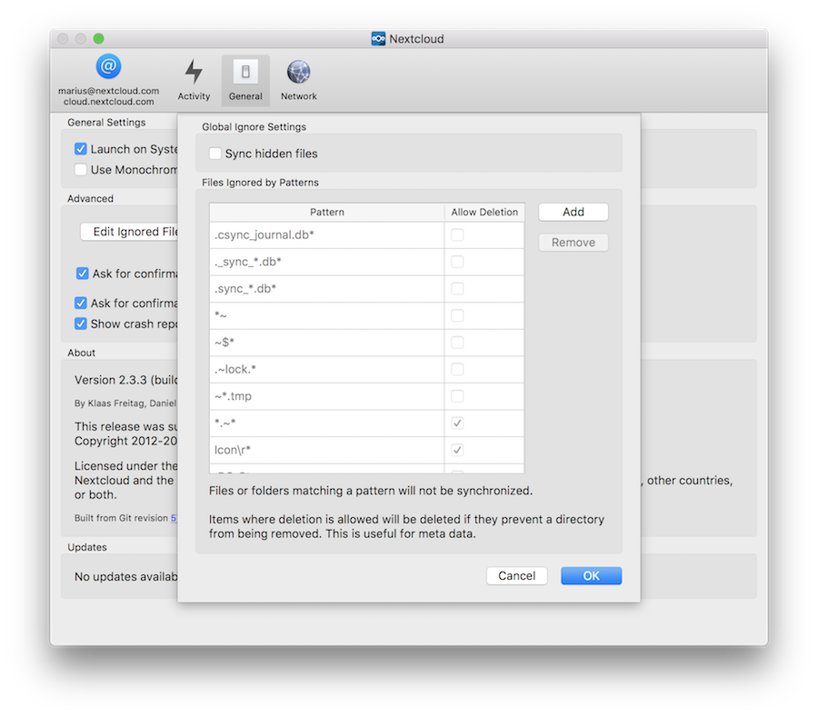

Using the Synchronization Client
================================

.. index:: navigating, usage

The ownCloud Client remains in the background and is visible as an icon in the
system tray (Windows, KDE), status bar (MAC OS X), or notification area
(Ubuntu).

.. image:: images/icon.png

This is a status indicator which uses overlay icons to indicate the 
current status of your synchronization. The green circle with the white checkmark 
tells you that your synchronization is current and you are connected to your 
ownCloud server.

.. image:: images/icon-syncing.png

The blue icon with the white semi-circles means synchronization is in progress.

.. image:: images/icon-paused.png

The yellow overlay icon with the parallel lines tells you your synchronization 
has been paused. (Most likely by you, by opening the client and clicking 
Account > Pause.)

The gray icon with three white dots means your sync client has lost its 
connection with your ownCloud server.

.. image:: images/icon-information.png

When you see a white circle with the letter "i" that is the informational icon, 
so you should click it to see what it has to tell you.

.. image:: images/icon-error.png

The red circle with the white "x" indicates a configuration error, such as an 
incorrect login or server URL.

Using the Desktop Client Menu
-----------------------------

A right click on the icon (left click on Ubuntu and Mac OS X) provides the
following menu:

.. image:: images/menu.png

**ownCloud Desktop Client menu**

The Desktop Client menu provides the following options:

* ``Open ownCloud in browser``: Launches the ownCloud WEB interface.
* ``Open folder 'ownCloud'``: Opens the ownCloud local folder. If you have 
  defined multiple synchronization targets, the window displays each local 
  folder.
* **Disk space indicator**: Indicates the amount of space currently used on the 
  server.
* Operation indicator: Displays the status of the current synchronization 
  process or indicates ``Up to date`` if the server and client are in sync.
* **Recent Changes**: Displays the last six files modified by the 
  synchronization operations and provides access to the current 
  synchronization status listing all changes since the last restart of the 
  ownCloud client.
* ``Settings...``: Provides access to the settings menu.
* ``Help``: Opens a browser to display ownCloud Desktop Client Guide.
* ``Sign out``: Disables the client from continued synchronizations.
* ``Quit ownCloud``: Quits the ownCloud Client, ending any currently running
  synchronizations.

Using the Account Settings Window
---------------------------------

.. index:: account settings, user, password, Server URL

The ``Account`` window provides a summary for general settings associated with 
the ownCloud account.  This window enalbes you to manage any synchronized 
folders in the account and enables you to modify them.

To access and modify the account settings:

.. image:: images/settings_account.png
   :scale: 50 %

The fields and options in this window include:

* ``Connected to <ownCloud instance> as <user>`` field:  Indicates the ownCloud 
  server to which the client is synchronizing and the user account on that 
  server.

* ``Add Folder...`` button: Provides the ability to add another folder to the 
  synchronization process (see ``Adding a Folder``).

* ``Pause/Resume`` button: Pauses the current sync (or prevents the client from 
  starting a new sync) or resumes the sync process.

* ``Remove`` button: Removes the selected folder from the sync process.  This 
  button is used when you want to synchronize only a few folders and not the 
  root folder.  If only the root folder is available, you must first remove the 
  root from the synchronization and then add individual folders that you want 
  to synchronize as desired.

* ``Storage Usage`` field: Indicates the storage utilization on the ownCloud 
  server.

* ``Edit Ignored Files`` button: Launches the Ignored Files Editor.

* ``Modify Account`` button: Enables you to change the ownCloud server to which 
  you are synchronizing. This option launches the ``Setting up an Account`` 
  dialog (see :doc:`accountsetup`).

Adding a Folder
^^^^^^^^^^^^^^^

The ``Add a Folder ...`` button enables you to add a new folder to the 
syncrhonization process.

To add a new folder:

1. Click the ``Add a Folder ...`` button in the Account window.

  The ``Add Folder...`` window opens

.. image:: images/folderwizard_local.png

2. Specify a *unique* path and alias name to the folder or use the ``Choose...`` 
   button to locate the new folder on your system to which you want to 
   synchronize.

.. note:: Nested synchronizations are not supported.  In other words, you
    cannot add a folder that is already contained within another synchronized
    folder. In addition, you cannot add a higher level (parent) folder that
    contains a folder to which you are already synchronizing.  By default, the
    ownCloud Set Up Wizard syncrhonizes your entire ownCloud account to the root
    folder of the ownCloud server. Due to this default setup, you must first 
    remove the top-level folder prior to specifying new synchronizations.

3. Click 'Next' to continue.

  A window opens prompting you to select a remote destination folder on the
  ownCloud server to which you want to synchronize.

.. image:: images/folderwizard_remote.png

4. Select a folder on the ownCloud server to which you want to synchronize your 
newly added folder.

..note:: A server folder can only be synchronized with a particular client 
  once. If you attempt to sync the root directory, you cannot sync with 
  other folders on the server. Similarly, if you sync with folder ``/a``, you 
  cannot create another sync with ``/a/b``, since ``b`` is already being 
  synched.

Editing Ignored Files
^^^^^^^^^^^^^^^^^^^^^

The :guilabel:`Ignored Files Editor` provides a list of preconfigured files
that are ignored (that is, not synchronized) by the client and server during
synchronizations. The Ignored Files Editor enables you to add patterns for
files or directories that you want to exclude from the synchronization process.
In addition to using standard characters, the Ignored Files Editor enables you
to use wild cards (for example, using an asterisk ‘*’ to indicate multiple
characters or a question mark ‘?’ to incidate a single character).

For additional information about this editor, see `Using the Ignored Files 
Editor`_

Using the Activity Settings Window
----------------------------------

.. index:: activity, recent changes, sync activity

The Activity window provides an in-depth account of recent synchronization
activity.  It shows files that have not been synchronized because they are on
the ignored files list or because they cannot be synced in a cross-platform
manner due to containing special characters that cannot be stored on certain
file systems.

.. image:: images/settings_activity.png

You can open the Activity window in one of the following ways:

- Click 'Activity' in the left frame of the ownCloud Settings window.

- Invoke the window from the ownCloud Desktop Client menu by selecting ``Recent
  Changes`` > ``Details...``.  (See Using the Desktop Client Menu.) 

Using the General Settings Window
---------------------------------

.. index:: general settings, auto start, startup, desktop notifications

The General settings window enables you to set general settings for the
ownCloud Desktop Client and provides information about the software version,
its creator, and the existance of any updates.

.. image:: images/settings_general.png

The settings and information contained in this window are as follows:

* ``Launch on System Startup`` checkbox: Provides the option to check (enable)
  or uncheck (disable) whether the ownCloud Desktop Client launches upon system
  startup.  By default, this option is enabled (checked)once you have configured
  your account.

* ``Show Desktop Nofications`` checkbox: Provides the option to check (enable)
  or uncheck (disable) bubble notifications alerting you as to when a set of
  synchronization operations is performed.

* ``Use Monochrome Icons`` checkbox: Provides the option to check (enable) or
   uncheck (disable) the use of monochrome (visually less obtrusive) icons.

.. note:: This option can be useful on MAC OSX platforms.

* ``About`` field: Provides information about the software authors along with
  pertinent build conditions.

.. note:: Information in this field can be valuable when submitting a support 
   request.

* ``Updates`` field: Provides information about any available updates for the
  ownCloud Desktop Client.

Using the Network Settings Window
---------------------------------

.. index:: proxy settings, SOCKS, bandwith, throttling, limiting

The Network settings window enables you to define network proxy settings as
well as limit the download and upload bandwidth utilization of file
synchronizations.

.. image:: images/settings_network.png

Specifying Proxy Settings
^^^^^^^^^^^^^^^^^^^^^^^^^

A proxy server is a server (for example, a computer system or an application)
that functions as an intermediary contact for requests from clients that are
seeking resources from other servers.  For the ownCloud Desktop Client, you can
define the following proxy settings:

* ``No Proxy`` option: Specifies that the ownCloud Client circumvent the default 
  proxy configured on the system.
* ``Use system proxy`` option: Default setting. Follows the systems proxy
  settings. On Linux systems, this setting uses the value of the variable
  ``http_proxy``.
* ``Specify proxy manually as`` option: Enables you to specify
  the following custom proxy settings:
  - ``HTTP(S)``: Used when you are required to use an HTTP(S) proxy server (for 
  example, Squid or Microsoft Forefront TMG). 
  - ``SOCKSv5``: Typically used in special company LAN setups, or in combination 
  with the OpenSSH
  dynamic application level forwarding feature (see ``ssh -D``).
  - ``Host``: Host name or IP address of the proxy server along with the port 
  number. HTTP proxies typically listen over Ports 8080 (default) or 3128. 
  SOCKS servers typically listen over port 1080.
* ``Proxy Server requires authentication`` checkbox: Provides the option to 
  check (enable/require) or
  uncheck (disable/not require) proxy server authentication. When not checked, 
  the proxy server must
  be configured to allow anonymous usage. When checked, a proxy server username 
  and password is required.

Bandwidth Limiting
^^^^^^^^^^^^^^^^^^

Synchronization of files between a client and server can utilized a lot of
bandwidth.  Bandwidth limiting can assist in shaping the total download or
upload bandwidth (or both) of your client/server connection to a more
manageable level. By limiting your bandwidth usage, you can maintain free
bandwidth for other applications to use.

The ownCloud Desktop Client enables you to limit (throttle) the bandwidth usage
for both file downloads and file uploads.  The Download Bandwidth field (for
data flowing from the ownCloud server to the client) provides the following
options:

- ``No limit`` option: The default setting for the client; specifies that there
  are no limit settings on the amount of data downloaded from the server. 

- ``Limit to <value> KBytes/s`` option: Limits (throttles) the bandwidth to
  a customized value (in KBytes/second).

The Upload Bandwidth field (for data flowing from the ownCloud client to the
server) provides the following options:

- ``No limit`` option: The default setting for the client; specifies that there
  are no limit settings on the amount of data downloaded from the server. 

- ``Limit automatically``: When enabled, the ownCloud client surrenders
  available bandwidth to other applications.  Use this option if there are
  issues with real time communication (for example, the use of IP phone or live
  streaming) in conjunction with the ownCloud Client.

- ``Limit to <value> KBytes/s`` option: Limits (throttles) the bandwidth to a
  customized value (in KBytes/second).

.. _ignoredFilesEditor-label:

Using the Ignored Files Editor
------------------------------

.. index:: ignored files, exclude files, pattern

You might have some files or directories that you do not want to backup and
store on the server. To identify and exclude these files or directories, you
can use the *Ignored Files Editor* that is embedded in the ownCloud Desktop
Client.

The ``Ignored Files Editor`` enables you to define customized patterns 
that the ownCloud Client uses to identify files and directories that you want 
to exclude from the synchronization process. For your convenience, the editor is
pre-populated with a default list of typically ignore patterns. These patterns
are contained in a system file (typically ``sync-exclude.lst``) located in the
ownCloud Client application directory. You cannot modify these pre-populated
patterns directly from the editor. However, if necessary, you can hover over
any pattern in the list to show the path and filename associated with that
pattern, locate the file, and edit the ``sync-exclude.lst`` file.

.. note:: Modifying the global exclude definition file might render the client
   unusable or result in undesired behavior.

Each line in the editor contains an ignore pattern string. When creating custom
patterns, in addition to being able to use normal characters to define an
ignore pattern, you can use wildcards characters for matching values.  As an
example, you can use an asterisk (``*``) to idenfify an arbitrary number of
characters or a question mark (``?``) to identify a single character. 

Patterns that end with a slash character (``/``) are applied to only directory
components of the path being checked.

.. note:: Custom entries are currently not validated for syntactical
   correctness by the editor, but might fail to load correctly.

Each pattern string in the list is preceded by a checkbox. When the check box
contains a check mark, in addition to ignoring the file or directory component
matched by the pattern, any matched files are also deemed "fleeting metadata"
and removed by the client.

In addition to excluding files and directories that use patterns defined in
this list:

- The ownCloud Client always excludes files containing characters that cannot
  be synchronized to other file systems.

- As of ownCloud Desktop Client version 1.5.0, files are removed that cause
  individual errors three times during a synchronization. However, the client
  provides the option of retrying a synchronization three additional times on
  files that produce errors.

For more detailed information see :ref:`ignored-files-label`.
