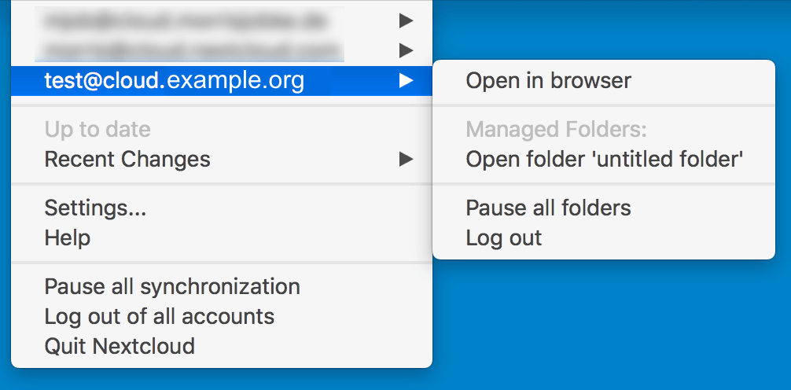
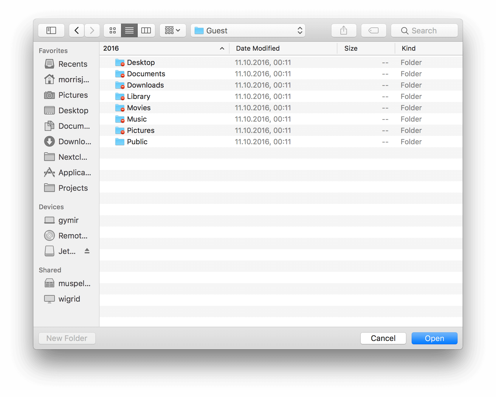

Visual Tour
===========

.. index:: visual tour, usage

Icon
----

The ownCloud Client remains in the background and is visible
as an icon in the system tray (Windows, KDE), status bar
(MAC OS X), or notification area (Ubuntu).

.. image:: images/icon.png

Menu
----

A right click on the icon (left click on Ubuntu and Mac OS X)
provides the following menu:

* ``Open ownCloud in browser``: Opens the ownCloud web interface
* ``Open folder 'ownCloud'``: Opens the local folder.  If multiple
  sync targets have been defined, an entry will exist for each local folder.
* **Disk space indicator**: Shows how much space is used on the server.
* Operation indicator: Shows the status of the current sync process, or
  ``Up to date`` if server and client are in sync.
* **Recent Changes**: shows the last six files modified by sync operations,
  and provides access to the Sync status, which lists all changes
  since the last restart of ownCloud Client.
* ``Settings...``: provides access to the settings menu.
* ``Help``: Opens a browser to display this help.
* ``Sign out``: Signs the client of of the server.
* ``Quit ownCloud``: Quits ownCloud Client, ending a currently running
  sync run.

Settings
--------

Account Settings
~~~~~~~~~~~~~~~~

.. index:: account settings, user, password, Server URL

The ``Account Settings tab`` provides an executive summary about the synced
folders in the account and gives the ability to modify them.

Where:

* ``Connected to <ownCloud instance> as <user>``: Indicates the ownCloud server
  which the client is syncing with and the user account on that server.

* ``Add Folder...``: Provides the ability to add another folder to the sync
  (see ``Adding a folder``).
* ``Pause/Resume``: Will pause the current sync or prevent the client from
  starting a new sync.  Resume will resume the sync process.
* ``Remove``: Will remove the selected folder from being synced.  This is used,
  for instance, when there is a desire to sync only a few folders and not the
  root.  First, remove the root from sync, then add the folders to sync as
  desired.
* ``Storage Usage``: Provides further details on the storage utilization on the
  ownCloud server.
* ``Edit Ignored Files``: Provides a list of files which will be ignored, i.e.
  will not sync between the client and server. The ignored files editor allows
  adding patterns for files or directories that should be excluded from the
  sync process. Besides normal characters, wild cards may be used, an asterisk
  ‘*’ indicating multiple characters, or a question mark ‘?’ indicating a single
  character.

* ``Modify Account``: Allows the user to change the ownCloud server being synced
  to. It brings up the Setting up an Account (see above) windows.

.. image:: images/settings_account.png
   :scale: 50 %

Adding a Folder
^^^^^^^^^^^^^^^

Adding a new sync is initiated by clicking ``Add Folder...`` in the ``Account``
settings.

..note:: To add a folder, you must not already sync a folder that contains this
        folder. By default, the wizard sets up the root folder of the ownCloud
        server to sync all of your ownCloud account. In consequence, you will
        first need to remove this folder prior to specifying new syncs.

.. image:: images/folderwizard_local.png
   :scale: 50 %

The Directory and alias name must be unique.

Select the folder on the server to sync with.  It is important to note that, a
server folder can only sync to the client one time.  So, in the above example,
the sync is to the server root directory and thus it is not possible to select
another folder under the root to sync.

Activity
~~~~~~~~

.. index:: activity, recent changes, sync activity

The Activity window, which can be invoked either from the main menu (``Recent
Changes -> Details…``) or the Activity tab on the left side of the settings
window, provides an in-depth account of the recent sync activity.  It will show
files that have not been synced because they are on the ignored files list, or
because they cannot be synced in a cross-platform manner due to containing
special characters that cannot be stored on certain file systems.

General
~~~~~~~

.. index:: general settings, auto start, startup, desktop notifications

The tab provides several useful options:

.. image:: images/settings_general.png
   :scale: 50 %

* ``Launch on System Startup``: This option is automatically activated
  once a user has conimaged his account. Unchecking the box will cause
  ownCloud client to not launch on startup for a particular user.
* ``Show Desktop Nofications``: When checked, bubble notifications when
  a set of sync operations has been performed are provided.
* ``Use Monochrome Icons``:  Use less obtrusive icons. Especially useful
  on Mac OS X.
* ``About``: provides information about authors as well as build conditions.
  This information is valuable when submitting a support request.

Network
~~~~~~~

.. index:: proxy settings, SOCKS, bandwith, throttling, limiting

This tab consollidates ``Proxy Settings`` and ``Bandwith Limiting``:

.. image:: images/settings_network.png
   :scale: 50 %

Proxy Settings
^^^^^^^^^^^^^^

* ``No Proxy``: Check this if ownCloud Client should circumvent the default
  proxy conimaged on the system.
* ``Use system proxy``: Default, will follow the systems proxy settings.
  On Linux, this will only pick up the value of the variable ``http_proxy``.
* ``Specify proxy manually as``: Allows to specify custom proxy settings.
  If you require to go through a HTTP(S) proxy server such as Squid or Microsoft
  Forefront TMG, pick ``HTTP(S)``. ``SOCKSv5`` on the other hand is particulary
  useful in special company LAN setups, or in combination with the OpenSSH
  dynamic application level forwarding feature (see ``ssh -D``).
* ``Host``: Enter the host name or IP address of your proxy server, followed
  by the port number. HTTP proxies usually listen on Ports 8080 (default) or
  3128. SOCKS server usually listen on port 1080.
* ``Proxy Server requires authentication``: Should be checked if the proxy
  server does not allow anonymous usage. If checked, a username and password
  must be provided.

Bandwidth Limiting
^^^^^^^^^^^^^^^^^^

The Download Bandwidth can be either unlimited (default) or limited to a
custom value.  This is the bandwidth available for data flowing from the
ownCloud Server to the client.

The Upload Bandwidth, the bandwidth available or data flowing from the
ownCloud client to the server, has an additional option to limit automatically.

When this option is checked, the ownCloud client will surrender available
bandwidth to other applications.  Use this option if there are issues with
real time communication in conjunction with the ownCloud Client.

.. _ignoredFilesEditor-label:

The Ignored Files Editor
~~~~~~~~~~~~~~~~~~~~~~~~

.. index:: ignored files, exclude files, pattern

ownCloud Client has the ability to exclude files from the sync process.
The ignored files editor allows editing of custom patterns for files or 
directories that should be excluded from the sync process. 

There is a system wide list of default ignore patterns. These global defaults 
cannot be directly modified within the editor. Hovering with the mouse will 
reveal the location of the global exclude definition file.

.. image:: images/ignored_files_editor.png
   :scale: 50%

Each line contains an ignore pattern string. Next to normal characters,
wildcards can be used to match an arbitrary number of characters, designated
by an asterisk (``*``) or a single character, designated by a question mark
(``?``). If a pattern ends with a slash character (``/``) the pattern is only
applied to directory components of the path to check.

If the checkbox is checked for a pattern in the editor it means that files
which are matched by this pattern are fleeting metadata which the client will
*remove*.

.. note:: Modifying the global exclude definition file might render the
   client unusable or cause undesired behavior.

.. note:: Custom entries are currently not validated for syntactical
   correctness by the editor, but might fail to load correctly.

In addition to this list, ownCloud Client always excludes files with
characters that cannot be synced to other file systems. 

With version 1.5.0 it also ignores files that caused individual errors 
while syncing for a three times. These are listed in the activity view.
There also is a button to retry the sync for another three times.

For more detailed information see :ref:`ignored-files-label`.
