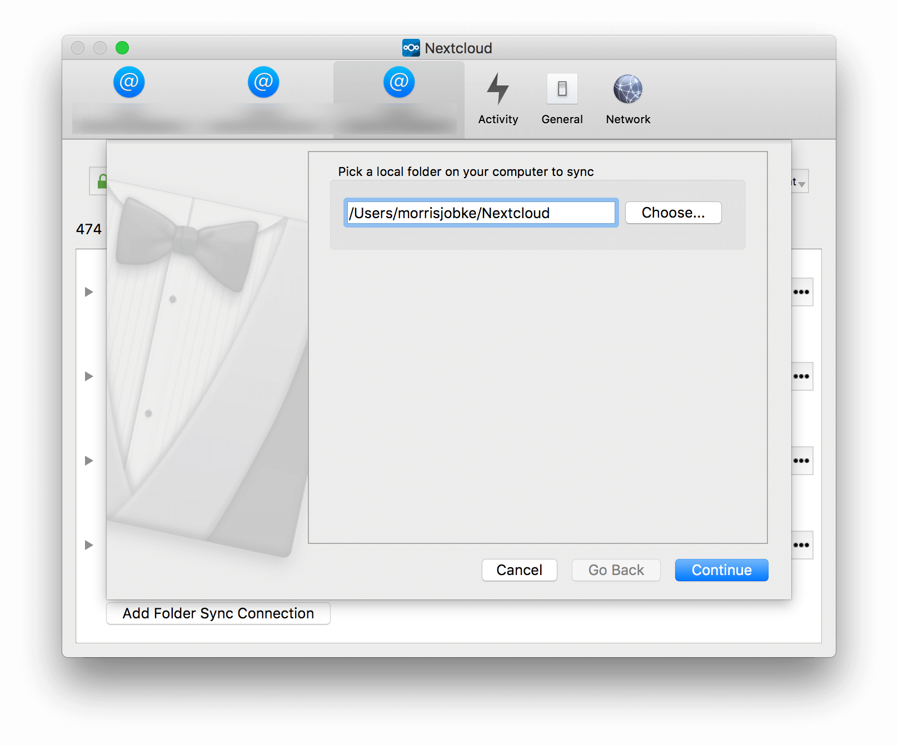

===========
Visual Tour
===========

.. index:: visual tour, usage

Icon
----

The Nextcloud Client remains in the background and is visible
as an icon in the system tray (Windows, KDE), status bar
(macOS), or notification area (Ubuntu).

.. image:: images/icon.png
   :alt: desktop client icon

Menu
----

.. image:: images/traymenu.png

A right click on the icon provides the following menu:

* ``Open main dialog``: Opens the main dialog.
* ``Pause sync``: Pauses the synchronization.
* ``Settings``: Provides access to the settings menu.
* ``Exit Nextcloud``: Quits Nextcloud Client, ending a currently running
  sync run.

.. NOTE::
    This menu is not available on macOS.

A double-click on the icon will open the currently-selected user's locally synced folder.

Settings
~~~~~~~~

Account Settings
~~~~~~~~~~~~~~~~

.. index:: account settings, user, password, Server URL

The ``Account Settings tab`` provides an executive summary about the synced
folders in the account and gives the ability to modify them.

Where:

* ``Connected to <Nextcloud instance> as <user>``: Indicates the Nextcloud server
  which the client is syncing with and the user account on that server.

* If the End-to-End encryption app is installed, then the current used
  passphrase can be shown with clicking on ``Display mnemonic``.

Clicking on the tree dot menu or doing a right click on the folder
opens up a context menu with the following options:

* ``Open folder``: Opens the folder in the file explorer which the
  operating system provides. In example on Windows it will open the Windows Explorer.
* ``Create new folder``: Creates a new folder.
* ``Force sync now``: Forces a synchronization run.
* ``Availability``: This entry is only available if the folder uses the
  virtual files feature. The files in the folder can be either made
  available offline with ``Make always available locally`` or if disk
  space needs to be saved, they can be turned into placeholder files
  with ``Free up local space``. ``Free up local space`` will not
  delete any files.
* ``Add folder sync connection``: Provides the ability to add another folder to the sync
  (see ``Adding a folder sync connection``).
* ``Pause sync/Resume sync``: Will pause the current sync or prevent the client from
  starting a new sync.  Resume will resume the sync process.
* ``Remove folder sync connection``: Will remove the selected folder from being synced.  This is used,
  for instance, when there is a desire to sync only a few folders and not the
  root.  First, remove the root from sync, then add the folders to sync as
  desired.
* ``Edit Ignored Files``: Provides a list of files which will be ignored, i.e.,
  will not sync between the client and server. The ignored files editor allows
  adding patterns for files or directories that should be excluded from the
  sync process. Besides normal characters, wild cards may be used, an asterisk
  ‘*’ indicating multiple characters, or a question mark ‘?’ indicating a single
  character.
* ``Enable virtual file support/Disable virtual file support``: Enable
  or disable virtual file support for this folder.

.. image:: images/settingsdialog.png

Adding a Folder Sync Connection
^^^^^^^^^^^^^^^^^^^^^^^^^^^^^^^

Adding a new sync is initiated by clicking ``Add Folder Sync Connection`` in
the ``Account`` settings.

The Directory and alias name must be unique.

Then select the folder on the server to sync with.  It is important to note that, a
server folder can only sync to the client one time.  So, in the above example,
the sync is to the server root directory and thus it is not possible to select
another folder under the root to sync.

.. image:: images/folderwizard_remote.png

General
~~~~~~~

.. index:: general settings, auto start, startup, desktop notifications

The tab provides several useful options:

.. image:: images/settings_general.png

* ``Launch on System Startup``: This option is automatically activated
  once a user has conimaged his account. Un-checking the box will cause
  Nextcloud client to not launch on startup for a particular user.
* ``Show Desktop Nofications``: When checked, bubble notifications when
  a set of sync operations has been performed are provided.
* ``Use Monochrome Icons``:  Use less obtrusive icons. Especially useful
  on macOS.
* ``About``: provides information about authors as well as build conditions.
  This information is valuable when submitting a support request.

Network
~~~~~~~

.. index:: proxy settings, SOCKS, bandwidth, throttling, limiting

This tab consolidates ``Proxy Settings`` and ``Bandwidth Limiting``:

.. image:: images/settings_network.png
   :scale: 50 %

Proxy Settings
^^^^^^^^^^^^^^

* ``No Proxy``: Check this if Nextcloud Client should circumvent the default
  proxy conimaged on the system.
* ``Use system proxy``: Default, will follow the systems proxy settings.
  On Linux, this will only pick up the value of the variable ``http_proxy``.
* ``Specify proxy manually as``: Allows to specify custom proxy settings.
  If you require to go through a HTTP(S) proxy server such as Squid or Microsoft
  Forefront TMG, pick ``HTTP(S)``. ``SOCKSv5`` on the other hand is particularly
  useful in special company LAN setups, or in combination with the OpenSSH
  dynamic application level forwarding feature (see ``ssh -D``).
* ``Host``: Enter the host name or IP address of your proxy server, followed
  by the port number. HTTP proxies usually listen on Ports 8080 (default) or
  3128. SOCKS server usually listen on port 1080.
* ``Proxy Server requires authentication``: Should be checked if the proxy
  server does not allow anonymous usage. If checked, a username and password
  must be provided.

Bandwidth Limiting
^^^^^^^^^^^^^^^^^^

The Download Bandwidth can be either unlimited (default) or limited to a
custom value.  This is the bandwidth available for data flowing from the
Nextcloud Server to the client.

The Upload Bandwidth, the bandwidth available or data flowing from the
Nextcloud client to the server, has an additional option to limit automatically.

When this option is checked, the Nextcloud client will surrender available
bandwidth to other applications.  Use this option if there are issues with
real time communication in conjunction with the Nextcloud Client.

.. _ignoredFilesEditor-label:

The Ignored Files Editor
~~~~~~~~~~~~~~~~~~~~~~~~

.. index:: ignored files, exclude files, pattern

Nextcloud Client has the ability to exclude files from the sync process.
The ignored files editor allows editing of custom patterns for files or
directories that should be excluded from the sync process.

There is a system wide list of default ignore patterns. These global defaults
cannot be directly modified within the editor. Hovering with the mouse will
reveal the location of the global exclude definition file.

.. image:: images/ignored_files_editor.png
   :scale: 50%

Each line contains an ignore pattern string. Next to normal characters,
wildcards can be used to match an arbitrary number of characters, designated
by an asterisk (``*``) or a single character, designated by a question mark
(``?``). If a pattern ends with a slash character (``/``) the pattern is only
applied to directory components of the path to check.

If the checkbox is checked for a pattern in the editor it means that files
which are matched by this pattern are fleeting metadata which the client will
*remove*.

.. note:: Modifying the global exclude definition file might render the
   client unusable or cause undesired behavior.

.. note:: Custom entries are currently not validated for syntactical
   correctness by the editor, but might fail to load correctly.

In addition to this list, Nextcloud Client always excludes files with
characters that cannot be synced to other file systems.

With version 1.5.0 it also ignores files that caused individual errors
while syncing for a three times. These are listed in the activity view.
There also is a button to retry the sync for another three times.

For more detailed information see :ref:`ignored-files-label`.

Main dialog
-----------

.. index:: activity, recent changes, sync activity, main dialog, adding account, account, add account, remove account, sync state, user status, unified search, share dialog

Sync State
~~~~~~~~~~

The main dialog, which can be invoked from the tray icon in the
taskbar, will show files information about the activities of the sync
client and Nextcloud.

.. image:: images/sync-state-paused.png
   :alt: sync state paused

.. image:: images/sync-state-syncing.png
   :alt: sync state syncing

.. image:: images/sync-state-synced.png
   :alt: sync state synced

If there are any synchronization issues, they will show up here:

.. image:: images/sync-state-warnings.png
   :alt: sync state warnings

For more information on how to solve these issues see :doc:`troubleshooting`.

When clicking on the avatar a menu opens where it is
possible to add a new account or removing an existing account.

.. image:: images/user-account-options.png
   :alt: user account options

User Status
~~~~~~~~~~~

User status is displayed in the Nextcloud desktop client's tray window.
Default user status is always "Online" if no other status is available from the server-side.

When clicking on ``Set status`` you can edit the emoji, message and the timer to clear your user status:

.. image:: images/set-user-status.png
   :alt: set user status menu option

|

.. image:: images/set-user-status-menu.png
   :alt: changing the user status

Activities list
~~~~~~~~~~~~~~~

The dialog also gives information about other activities or
notifications like Talk mentions or file changes.
It does also show the status of the user.

.. image:: images/main_dialog.png
   :alt: main dialog activities list

Unified search
~~~~~~~~~~~~~~

With the unified search you can find everything you have in your server - files,
Talk messages, calendar appointments:

.. image:: images/unified-search-files.png
   :alt: unified search files search result

.. image:: images/unified-search-talk.png
   :alt: unified search Talk conversations search result

.. image:: images/unified-search-events.png
   :alt: unified search calendar appointments search result

Share dialog: Talk options and View Profile
~~~~~~~~~~~~~~~~~~~~~~~~~~~~~~~~~~~~~~~~~~~

You can now share a file directly in a conversation in Talk and view the sharee user profile:

.. image:: images/open-share-dialog.png
   :alt: open share dialog option

|

.. image:: images/share-dialog-view-profile.png
   :alt: shared dialog sharing options
