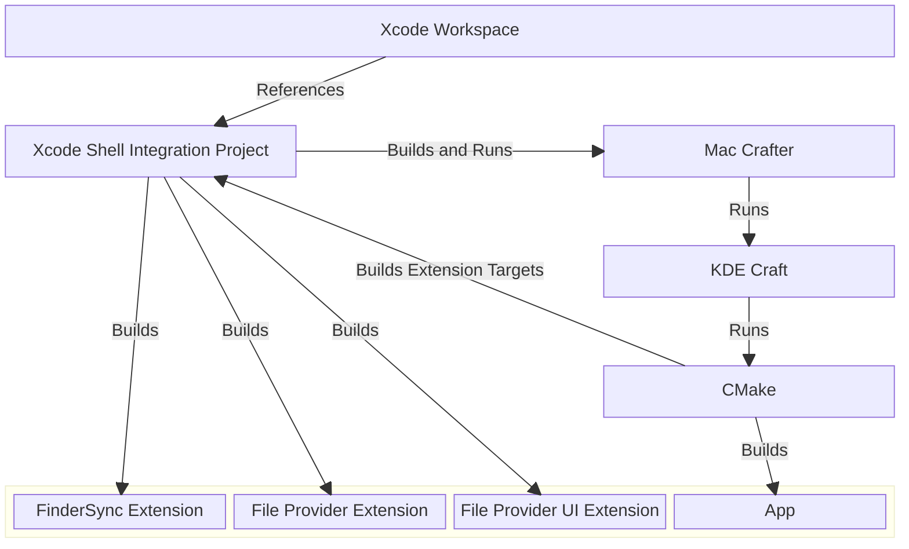

<!--
  - SPDX-FileCopyrightText: 2026 Nextcloud GmbH and Nextcloud contributors
  - SPDX-License-Identifier: GPL-2.0-or-later
-->

# Xcode Workspace

**tl;dr:** Open "[Nextcloud Desktop Client.xcworkspace](../Nextcloud%20Desktop%20Client.xcworkspace/)", select "NextcloudDev" scheme and hit `⌘ + R`.

---

The Nextcloud desktop client project comes with an [Xcode workspace](https://developer.apple.com/documentation/xcode/managing-multiple-projects-and-their-dependencies) prepared for contributors on macOS.
Xcode is the default integrated developer environment on macOS provided by Apple.
Many developers on the platform are familiar with it.
Further, our multi-platform [Qt](https://www.qt.io) app includes native macOS app extensions written in Swift and Objective-C which are more convenient to debug and best supported in Xcode.

## Project structure

- The workspace is an umbrella for various Swift packages and an Xcode project with different targets. The packages and the Xcode project for the macOS app extensions are meant to remain functionally independent from the workspace, though. They have dedicated documentation to explain them in detail.
- The Xcode shell integration project contains an optional convenience target for developers which runs `mac-crafter` through a shell script with some default arguments.
- Mac crafter itself is a commandline tool to simplify and reduce the build on macOS to a single shell command. It invokes KDE Craft and CMake.
- CMake itself uses the Xcode project again to build the native app extension targets contained in there.
- Afterwards, CMake combines the Qt main app build with CMake and the native macOS app extensions built by `xcodebuild` into a macOS app bundle.
- The lower block describes the Nextcloud desktop client app bundle being built by this project.
- Further project specific dependencies like NextcloudFileProviderKit, NextcloudCapabilitiesKit or TransifexStringCatalogSanitizer have been left out for simplicity.

## Project navigator

The workspace is set up to contain references to the most important files, directories, packages and projects.
Especially platform-specific code for other platforms has been left out to focus on content relevant on macOS.

## Build artifacts

To isolate working environments and simplify cache busting, build artifacts and derived data are stored in unconventional locations.
Also, this sometimes helps to resolve KDE Craft build errors which are caused by too long file paths.

### Xcode

The Xcode workspace defines the `.xcode` directory in the repository clone root as the location for its derived data which usually is located elsewhere by default.

### Mac Crafter

The mac-crafter is called with the `.mac-crafter` directory in the repository clone root as the location for its build data which usually is located elsewhere by default. See [Craft.sh](./../shell_integration/MacOSX/NextcloudIntegration/NextcloudDev/Craft.sh).

In some occassions KDE Craft dependencies failed to build due to too long path names.
This top-level location helps to reduce that risk while maintaining isolation to other repositories on a Mac.

### Cleanup

When you have no build running, it definitely is safe to remove the previously mentioned directories.
Sometimes this is necessary to resolve build errors caused by outdated intermediate artifacts.
